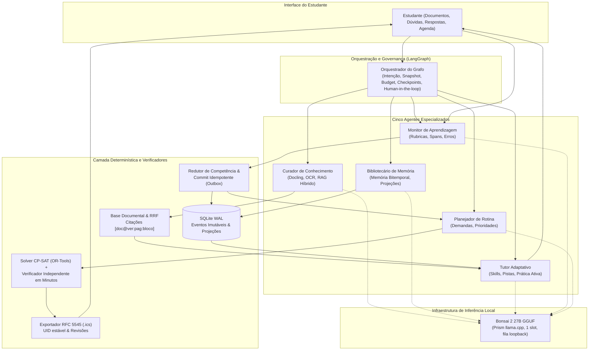

# EduAgent-OS — Sistema Multiagente Local para Tutoria Ativa e Gestão Longitudinal de Estudos

**MO810A / MC959A — Sistemas Multiagentes com Modelos de Linguagem**  
**Instituto de Computação (IC) — UNICAMP — 2026**  
**Docente:** Prof. Dr. Julio Cesar dos Reis  

---

## 👥 Integrantes da Dupla

| Nome | RA | E-mail / Contato |
| :--- | :---: | :--- |
| **Rafael Attilio Agricola** | `249245` | IC / UNICAMP |
| **Jociclelio Castro Macedo Junior** | `231722` | IC / UNICAMP |

---

## 📌 Sumário

1. [Visão Geral do Projeto](#-visão-geral-do-projeto)
2. [Premissas de Engenharia e Princípios Arquiteturais](#-premissas-de-engenharia-e-princípios-arquiteturais)
3. [Arquitetura Multiagente](#-arquitetura-multiagente)
   - [Os Cinco Agentes Lógicos](#os-cinco-agentes-lógicos)
   - [Diagrama da Arquitetura](#diagrama-da-arquitetura)
   - [Modelo Local e Inferência](#modelo-local-e-inferência)
4. [Componentes e Requisitos do Sistema (C01–C20)](#-componentes-e-requisitos-do-sistema-c01c20)
5. [Fluxos Operacionais, Saídas e Modos de Falha](#-fluxos-operacionais-saídas-e-modos-de-falha)
   - [Fluxos de Trabalho (W01–W12)](#fluxos-de-trabalho-w01w12)
   - [Catálogo de Saídas (O01–O18)](#catálogo-de-saídas-o01o18)
   - [Catálogo de Falhas (F01–F24) e Mitigações](#catálogo-de-falhas-f01f24-e-mitigações)
6. [Persistência, Transações e Governança de Efeitos](#-persistência-transações-e-governança-de-efeitos)
7. [Planejamento Temporal e Solver de Grade](#-planejamento-temporal-e-solver-de-grade)
8. [Metodologia de Avaliação e Testbed](#-metodologia-de-avaliação-e-testbed)
   - [Perguntas de Pesquisa](#perguntas-de-pesquisa)
   - [Condições Experimentais e Comparações](#condições-experimentais-e-comparações)
   - [Métricas e Critérios de Aceite](#métricas-e-critérios-de-aceite)
9. [Estrutura do Repositório](#-estrutura-do-repositório)
10. [Instalação, Configuração e Execução](#-instalação-configuração-e-execução)
    - [Pré-requisitos e Ambiente Python](#pré-requisitos-e-ambiente-python)
    - [Variáveis de Ambiente](#variáveis-de-ambiente)
    - [Notebooks da Disciplina](#notebooks-da-disciplina)
    - [Compilação dos Documentos da Fase 1](#compilação-dos-documentos-da-fase-1)
    - [Compilação, Validação e Pacote da Fase 2](#compilação-validação-e-pacote-da-fase-2)
11. [Convenções de Desenvolvimento e Versionamento](#-convenções-de-desenvolvimento-e-versionamento)
12. [Referências Bibliográficas Fundamentais](#-referências-bibliográficas-fundamentais)

---

## 🎯 Visão Geral do Projeto

O **EduAgent-OS** é um sistema multiagente (MAS) voltado ao apoio integral a estudantes universitários de graduação. O sistema atua de ponta a ponta na rotina acadêmica:
1. **Ingestão e Fundamentação:** Processa documentos oficiais de disciplinas (Plano de Desenvolvimento de Disciplina — PDD, cronogramas, notas de aula, listas de exercícios e PDFs fornecidos pelo estudante);
2. **Tutoria Ativa e Formativa:** Conduz sessões de estudo interativas, com explicações socráticas, geração de exercícios graduados, flashcards atômicos e estímulo à autoexplicação;
3. **Monitoramento de Aprendizagem:** Avalia respostas discursivas e objetivas via rubricas pedagógicas estritas, diferenciando ajuda recebida de desempenho independente, e identificando concepções alternativas (*misconceptions*);
4. **Memória Longitudinal Bitemporal:** Preserva o histórico formativo e fatos acadêmicos ao longo do semestre com rastreabilidade temporal (`occurred_at` vs. `recorded_at`), permitindo correções retroativas sem perda de integridade;
5. **Planejamento de Estudos e Exportação de Calendário:** Mapeia defasagens pedagógicas e avaliações iminentes em demandas de estudo semanais, organizadas por um solver exato determinístico em slots de 15 minutos, gerando arquivos de calendário compatíveis com a RFC 5545 (iCalendar / `.ics`).

O projeto é guiado centralmente pelo **ODS 4 — Educação de Qualidade** (Meta 4.3 e 4.4 da ONU), promovendo a autonomia dos estudantes e o estudo sustentável, além de contribuir indiretamente com os **ODS 9 e 10** ao priorizar computação local acessível e soberania sobre dados pessoais.

---

## ⚙️ Premissas de Engenharia e Princípios Arquiteturais

- **Inferência Primariamente Local:** O núcleo operacional opera integralmente *offline* com modelos quantizados executados localmente via runtime especializado, garantindo privacidade estrita dos dados estudantis e previsibilidade de custos.
- **Coordenação por Grafo Explícito (LangGraph):** A orquestração não é um chat irrestrito ou emergente entre agentes, mas sim uma máquina de estados finitos direcionada, com rotas estritas, checkpoints transacionais, orçamentos limitados por turno e suporte a pausas para confirmação humana (*human-in-the-loop*).
- **Contratos Tipados Pydantic v2:** Todas as fronteiras de comunicação utilizam schemas Pydantic estritos (`extra='forbid'`), identificadores estáveis (UUID) e referências imutáveis baseadas em conteúdo (`*_ref`).
- **Primazia do Determinismo:** O Modelo de Linguagem (LLM) propõe conteúdo, hipóteses e demandas; verificadores e redutores determinísticos independentes validam restrições, persistem estados, aplicam rubricas e determinam a viabilidade matemática de agendas.
- **Ausência de Alucinações Silenciosas:** Diante de dados ilegíveis, prazos ambíguos ou ausência de fontes documentais, o sistema declara explicitamente abstenção, pendência ou conflito, jamais inventando fatos ou confirmando restrições sem intervenção do estudante.

---

## 🏛️ Arquitetura Multiagente

### Os Cinco Agentes Lógicos

1. **Curador de Conhecimento (`Curator`):**
   - *Responsabilidade:* Ingestão de arquivos (Docling + OCR seletivo), extração de tópicos e fatos acadêmicos candidatos, indexação e recuperação híbrida (RAG BM25 + BGE-M3 + RRF).
   - *Artefatos Produzidos:* Manifesto de blocos, catálogo de tópicos/prazos candidatos e `EvidencePack` estruturado com citações canônicas de proveniência `[doc_id@versão:página:bloco]`.
   - *Fronteira:* Não promove prazos automaticamente; não executa conteúdo documental como código ou comando.

2. **Tutor Adaptativo (`Tutor`):**
   - *Responsabilidade:* Condução pedagógica e geração de atividades a partir de um catálogo versionado de habilidades (*Skills*: explicação conceitual, pistas graduadas 1..3, quiz, flashcards e autoexplicação).
   - *Artefatos Produzidos:* Turnos pedagógicos (`TutorTurn`) e itens de aprendizagem (`LearningItem`) com gabarito e rubricas desacoplados da pergunta.
   - *Fronteira:* Termina o turno em espera explícita do estudante (`waiting_student`); não altera agendas nem infere domínio definitivo.

3. **Monitor de Aprendizagem (`Monitor`):**
   - *Responsabilidade:* Avaliação formativa das respostas dos estudantes com base no gabarito e em rubricas analíticas com níveis 0 (incorreto/ausente), 1 (parcial) e 2 (adequado).
   - *Artefatos Produzidos:* Avaliações formativas (`Assessment`), evidências de resposta com *spans* textuais comprovados e identificação de códigos de erro conceitual.
   - *Fronteira:* Não emite notas institucionais; abstém-se diante de ambiguidade; não converte autorrelato em comprovação de competência.

4. **Planejador de Rotina e Agenda (`Planner`):**
   - *Responsabilidade:* Traduz necessidades de estudo e revisões em demandas temporais (`StudyDemand`), interpretando preferências e restrições.
   - *Artefatos Produzidos:* Propostas de rotina semanal (`ScheduleProposal`), relatórios de conflito/inviabilidade e exportações iCalendar (`.ics`).
   - *Fronteira:* A viabilidade da agenda é formalizada e provada pelo solver CP-SAT e por um verificador independente, nunca pelo texto livre do LLM.

5. **Bibliotecário de Memória (`Librarian`):**
   - *Responsabilidade:* Recuperação e consolidação de eventos bitemporais, rastreamento de preferências corrigíveis, histórico de tentativas e sínteses de contexto sob limites estritos de tokens.
   - *Artefatos Produzidos:* Pacotes de memória (`MemoryPack`), projeções versionadas de competência por tópico e recibos de correção.
   - *Fronteira:* Não escreve diretamente no banco de dados; sínteses derivadas mantêm referências aos eventos originais para fins de auditoria e exclusão lógica.

---

### Diagrama da Arquitetura



---

### Modelo Local e Inferência

- **Modelo Candidato Adotado:** `prism-ml/Ternary-Bonsai-2-27B-gguf` (revisão `b072e1d3b35a0a630cece372c2127528e0994386`), arquivo `Ternary-Bonsai-2-27B-PTQ1_0.gguf` (alternativa de alta eficiência: `PQ2_0`).
- **Runtime Local:** Fork especializado `PrismML-Eng/llama.cpp` (release `prism-b10743-adfffbe`), executado como servidor HTTP loopback isolado com 1 slot de contexto e fila limitada a 4 requisições.
- **Orçamento de Janela de Contexto (32.768 tokens):**
  $$\text{Janela Total} = 32.768 \ge T_{\text{entrada}} + 16.384 \,(\text{saída}) + 2.048 \,(\text{ferramentas}) + 1.024 \,(\text{margem})$$
  Com limite estrito de $T_{\text{entrada}} \le 13.312$ tokens (fontes documentais até 4.096 tokens, memória até 2.048 tokens em até 8 unidades).
- **Gate de Admissão:** Antes da liberação, o modelo passa por testes de conformidade offline (tokenizer real, geração em português, parse de JSON estrito e recusa de ferramentas indevidas). Se reprovado, emite o status tipado `MODEL_NOT_ADMITTED`.

---

## 📋 Componentes e Requisitos do Sistema (C01–C20)

A especificação de engenharia divide o sistema em 20 componentes essenciais com critérios mensuráveis:

| ID | Componente | Responsabilidade e Critério Verificável |
| :---: | :--- | :--- |
| **C01** | **Inferência Local** | Execução offline via Bonsai 2 27B quantizado no fork Prism de llama.cpp; JSON Schema validado; servidor loopback com fila controlada. |
| **C02** | **Ingestão e Proveniência** | Parser Docling com OCR seletivo (OCRmyPDF) em português/inglês; blocos com bounding boxes e páginas físicas; diagnóstico de ilegibilidade. |
| **C03** | **Ontologia Acadêmica** | Entidades relacionais estruturadas (Curso, Tópico, Pré-requisito, Avaliação, Recurso) com timezone IANA e status de confiança (`candidate/ambiguous/confirmed`). |
| **C04** | **RAG Documental Híbrido** | Busca lexical BM25 (`rank_bm25`) combinada a busca densa BGE-M3 via RRF ($k=60$); reranker opcional BGE-v2-m3; citações canônicas estritas e abstenção explícita. |
| **C05** | **Curadoria Conectada (Opcional)** | Mecanismo de busca e fetch com cotas e limites (10 s, 5 MiB); rastreamento estrito de estados (`metadata_only`, `text_read`, `transcript_read`); sem URLs fictícias. |
| **C06** | **Tutor e Catálogo de Skills** | Habilidades pedagógicas versionadas em YAML (explicar, pistas graduadas, quiz, flashcard, autoexplicação); apoio contingente e respeito a paradas do aluno. |
| **C07** | **Monitor Formativo** | Julgamento por rubricas analíticas com níveis 0/1/2; correspondência com spans reais da resposta; diferenciação entre acerto independente e com auxílio. |
| **C08** | **Estado de Aprendizagem** | Rastreamento determinístico por tópico; classificação temporal em `insufficient`, `mixed` ou `favorable` provisório (após 3 acertos independentes consecutivos); estimativa numérica nula no MVP. |
| **C09** | **Memória Persistente Bitemporal** | SQLite com log imutável de eventos (`occurred_at` vs. `recorded_at`), fatos vigentes com encadeamento `supersedes` e isolamento estrito por usuário. |
| **C10** | **Gestão de Contexto e Síntese** | Contagem exata de tokens via tokenizer real; priorização de fatos críticos (prazos, ajuda e rubricas) antes de aplicar sumarização. |
| **C11** | **Planejador e Solver de Agenda** | Formalização matemática no Google OR-Tools (CP-SAT) em slots de 15 min no horizonte de 7 dias; checagem independente em minutos originais; tratamento de inviabilidade. |
| **C12** | **Exportação de Calendário (ICS)** | Geração de arquivos iCalendar RFC 5545 válidos via `icalendar`; UIDs e ocorrências estáveis; sincronização CalDAV/Google tratada como extensão opcional via Outbox. |
| **C13** | **Orquestração por Grafo** | Máquina de estados LangGraph; rotas fixas com limites de passos (máx 16) e chamadas LLM (máx 6); checkpoints persistentes com suporte a pausa e retomada. |
| **C14** | **Comunicação e Contratos** | Envelopes Pydantic v2 estritos com controle de versão de snapshot e referências tipadas; barreira de segurança impedindo injeção de instruções em payloads. |
| **C15** | **Política de Ferramentas** | Allowlist por papel de agente; validação programática de argumentos; bloqueio de caminhos fora da sandbox (anti-traversal) e negação de rede local em fetches. |
| **C16** | **Persistência e Recuperação** | SQLite WAL/FULL com transações atômicas curtas; suporte a replay pós-crash; controle de concorrência otimista via contador monotônico `domain_revision`. |
| **C17** | **Observabilidade e Limites** | Rastreamento local OpenTelemetry por turno; log de contadores reais de tokens, latência de fila, picos de RSS/VRAM e cancelamento limpo sob watchdog. |
| **C18** | **Conjunto de Dados e Ouro** | Corpus acadêmico de duas disciplinas de graduação (formal e conceitual); anotação independente por especialistas com rubricas de ouro e splits sem vazamento de famílias. |
| **C19** | **Avaliação Experimental** | Protocolo pareado contra agente único (SA) de mesmos recursos; ablações de arquitetura; bootstrap pareado por cluster ($B=10.000$); margem de não-inferioridade. |
| **C20** | **Empacotamento e Reprodutibilidade** | Manifesto imutável com hashes SHA-256 de dados, binários, pesos de modelo e lockfiles (`uv.lock`); scripts de verificação e smoke tests locais. |

---

## 🔄 Fluxos Operacionais, Saídas e Modos de Falha

### Fluxos de Trabalho (W01–W12)

| ID | Fluxo | Disparador | Saídas Principais | Término e Variações |
| :---: | :--- | :--- | :--- | :--- |
| **W01** | **Ingestão e Confirmação** | Upload de PDF/texto | O01 (Blocos), O02 (Fatos/Tópicos) | Concluído, pendência de confirmação ou erro de ilegibilidade/limite. |
| **W02** | **Consulta Fundamentada** | Pergunta do aluno | O03 (Evidências), O04 (Explicação) | Resposta fundamentada com citações, explicação rotulada ou abstenção explícita. |
| **W03** | **Prática e Apoio Gradual** | Pedido de estudo/treino | O05 (Item), O06 (Flashcard), O07 (Pistas) | Turno concluído, entrega de pistas (1..3), revelação de solução ou parada. |
| **W04** | **Avaliação Formativa** | Submissão de resposta | O08 (Avaliação), O09 (Estado/Revisão) | Avaliação aceita (níveis 0..2) ou abstenção; persistência no histórico. |
| **W05** | **Retomada Longitudinal** | Nova sessão de estudo | O10 (Memória), O11 (Síntese) | Contexto reconstituído com fatos vigentes e eventos recentes. |
| **W06** | **Planejamento Semanal** | Pedido de organização | O12 (Demandas), O13 (Proposta de Agenda) | Proposta viável apresentada, diagnóstico de conflito ou pedido de esclarecimento. |
| **W07** | **Replanejamento Dinâmico** | Erro formativo ou atraso | O09 (Revisão), O13 (Diff de Agenda) | Ajuste da grade respeitando compromissos fixos e histórico de ocorrências. |
| **W08** | **Exportação de Agenda** | Aprovação de plano | O14 (Arquivo .ics / Recibo) | Geração de ICS válido ou enfileiramento em outbox de sincronização. |
| **W09** | **Curadoria Conectada** | Busca de materiais extras | O15 (Recurso Curado com Status) | Metadados catalogados, transcrição processada ou fallback offline datado. |
| **W10** | **Gestão Explícita de Dados** | Correção ou exclusão | O10 (Memória Corrigida), O16 (Recibo) | Confirmação de escopo, invalidação de derivados e tombstone de exclusão. |
| **W11** | **Recuperação Operacional** | Crash, timeout ou cancel | O16 (Status de Recuperação), O17 (Traces) | Replay a partir de checkpoint, cancelamento seguro ou relatório de limite. |
| **W12** | **Instalação e Diagnóstico** | Comando `doctor` / restore | O18 (Manifesto / Diagnóstico) | Validação de dependências, integridade de banco de dados e testes de fumaça. |

---

### Catálogo de Saídas (O01–O18)

- **O01 (Manifesto e Blocos Documentais):** Texto extraído, ordem lógica de leitura, páginas físicas e hashes de blocos sem inversões.
- **O02 (Tópicos, Fatos e Prazos):** Entidades acadêmicas normalizadas, fusão de sinônimos e prazos com timezone sem promoções silenciosas.
- **O03 (Evidências e Citações):** Chunks textuais recuperados com formato canônico `[doc@ver:pag:bloco]` resolvível no snapshot.
- **O04 (Explicação Conceitual):** Texto pedagógico claro, correto, delimitado e apoiado nas fontes recuperadas.
- **O05 (Exercício / Quiz):** Enunciado decidível com gabarito formal desacoplado e critérios de equivalência pré-definidos.
- **O06 (Flashcard Atômico):** Par frente/verso atômico e balanceado, com indicação de fonte e sem vazamento precoce da resposta.
- **O07 (Turno de Apoio / Pista):** Intervenção contingente baseada na dificuldade demonstrada, respeitando os 3 níveis de dicas e paradas legítimas.
- **O08 (Avaliação Formativa):** Parecer estruturado com níveis 0/1/2, vinculação a *spans* reais da resposta do aluno e identificação de equívocos.
- **O09 (Estado de Aprendizagem):** Projeção reproduzível da competência por tópico, preservando o grau de ajuda e registrando revisões devidas.
- **O10 (Memória Temporal):** Recuperação de fatos vigentes e eventos passados sem contaminação entre usuários ou ressurgimento de fatos substituídos.
- **O11 (Síntese de Contexto):** Compactação sob limite estrito de tokens preservando prazos, polaridade e evidências críticas.
- **O12 (Demandas de Estudo):** Demandas mapeadas a partir de avaliações e defasagens, com distinção clara entre durações estimadas e confirmadas.
- **O13 (Proposta de Agenda):** Grade temporal em blocos contíguos sem sobreposições, acompanhada de diff em relação ao plano anterior.
- **O14 (Arquivo de Calendário .ics):** Serialização RFC 5545 sem perdas de timezone, com UIDs e números de sequência estáveis.
- **O15 (Recurso Curado):** Metadados e links verificados, com atestado de acesso real e sem resumos fictícios de vídeos sem transcrição.
- **O16 (Recibo de Transação):** Identificador unívoco de operação persistida, atestando atomicidade e estado de efeitos colaterais.
- **O17 (Telemetria e Traces):** Spans detalhados de execução, consumo de tokens, latências decompostas e registros de falhas.
- **O18 (Diagnóstico e Manifesto):** Checksum de artefatos, registro de hardware, versão de dependências e estado de saúde operacional.

---

### Catálogo de Falhas (F01–F24) e Mitigações

O sistema implementa barreiras arquiteturais contra 24 modos de falha catalogados:

```
[Falhas de Entrada e Ingestão]
  F01 (Erro de OCR/Tabela) ─────────► Diagnóstico de qualidade e recusa de promoção sem verificação
  F02 (Ambiguidade de Prazo) ──────► Intervenção humana obrigatória para confirmação de datas

[Falhas de Recuperação e Geração]
  F03 (Omissão de Fontes) ─────────► Busca híbrida (BM25 + BGE-M3 + RRF) e abstenção explícita
  F04 (Alucinação de Citação) ─────► Verificador canônico de resolução [doc@ver:pag:bloco]
  F05 (Vazamento de Solução) ──────► Protocolo estrito de 3 pistas e encerramento a pedido do aluno
  F06 (Viés no Monitor) ───────────► Rubricas analíticas 0/1/2 e desacoplamento do Tutor

[Falhas de Estado e Memória]
  F07 (Atribuição Incorreta) ──────► Redutor determinístico separa acerto independente de assistido
  F08 (Anacronismo Temporal) ──────► Rastreamento bitemporal (occurred_at vs. recorded_at)
  F09 (Perda na Compactação) ──────► Validador de preservação de tuplas críticas e prazos
  F10 (Incompatibilidade de Schema)► Validação Pydantic v2 estrita (extra='forbid')

[Falhas Operacionais e de Orquestração]
  F11 (Loop no Grafo) ─────────────► Limite máximo de 16 passos e 6 chamadas LLM por turno
  F12 (Estouro de Contexto/OOM) ───► Janela reservada fixa (32k) e watchdog ativo de 120 s
  F13 (Conflito no Solver) ────────► Verificador independente em minutos originais
  F14 (Concorrência/Stale Data) ───► Controle de concorrência por domain_revision monotônica
  F15 (Falha de Envio/Crash) ──────► Padrão Outbox transacional e reconciliação por idempotência

[Falhas de Segurança e Integridade]
  F16 (Prompt Injection em PDF) ──► Tratamento de dados documentais como texto passivo rotulado
  F17 (Escape de Diretório/User) ──► Validação de caminhos canônicos e isolamento por user_id
  F18 (Corrupção de SQLite) ──────► Modo WAL/FULL e replays a partir de log de eventos
  F19 (Indisponibilidade de Rede) ──► Fallback graceful com operação núcleo 100% offline
  F20 (Erro no Arquivo .ics) ──────► Serialização RFC 5545 auditada por parser independente
  F21 (Ressurgimento de Excluídos)─► Invalidação em cascata via tabela artifact_dependencies
  F22 (Subcontagem de Custos) ─────► Instrumentação externa de telemetria em todas as chamadas
  F23 (Viés na Avaliação) ─────────► Avaliação cega pareada com rotação de ordem e oráculos
  F24 (Ambiente Não Reprodutível) ─► Manifesto imutável, locks de dependências e seeds fixas
```

---

## 💾 Persistência, Transações e Governança de Efeitos

1. **Modelo de Armazenamento SQLite WAL:**
   - O banco relacional utiliza modo `WAL` (*Write-Ahead Logging*) com escrita serializada, transações curtas e constraints habilitados.
   - O schema segrega dados brutos, eventos imutáveis, projeções atualizáveis e logs de operações:
     - `users`, `courses`, `topics`, `topic_edges`
     - `documents`, `doc_versions`, `blocks`, `chunks`
     - `facts` (com `status`, `authority` e encadeamento `supersedes`)
     - `events`, `items`, `attempts`, `assessments`, `topic_states`
     - `demands`, `plans`, `logical_blocks`
     - `operations`, `outbox`, `confirmations`, `artifact_dependencies`
2. **Controle de Concorrência por `domain_revision`:**
   - Cada usuário possui um contador monotônico global (`users.domain_revision`).
   - Qualquer mutação confirmada incrementa o contador atômica e monotonicamente. O snapshot lido pelos agentes carrega essa revisão fixa. Tentativas de gravação com revisão defasada resultam em `VERSION_CONFLICT`, exigindo releitura.
3. **Idempotência Estrita via `operation_id`:**
   - Antes de aplicar qualquer commit, o serviço verifica se o `operation_id` já existe:
     - Se o ID e o digest forem idênticos: retorna imediatamente o recibo original registrado, mesmo que a versão esperada esteja desatualizada.
     - Se o digest ou usuário forem divergentes: rejeita a requisição como erro.
4. **Padrão Outbox para Efeitos Externos:**
   - Exportações remotas de agenda ou notificações são gravadas na tabela `outbox` na mesma transação que confirma o plano.
   - Um dispatcher independente com concessão temporal (*lease*) processa a fila, garantindo entrega com reconciliação pós-timeout (*at-least-once* controlado por identidade).
5. **Privacidade e Exclusão Lógica Auditável:**
   - A tabela `artifact_dependencies` mapeia relacionamentos pai-filho (`derived_from`, `corrects`, `supersedes`).
   - Pedidos de exclusão de dados pessoais propagam imediatamente a invalidação para projeções, caches e resumos derivados, aplicando marcadores *tombstone* sem manter hashes reversíveis de textos removidos.

---

## 📅 Planejamento Temporal e Solver de Grade

O módulo de planejamento traduz objetivos educacionais em rotinas práticas de estudo:

1. **Geração Determinística de Demandas (`assessment_review_policy_v1`):**
   - Tentativa incorreta ou erro crítico $\rightarrow$ revisão sugerida no próximo dia com disponibilidade.
   - Acerto independente $\rightarrow$ revisões espaçadas candidatas em 1, 3 e 7 dias.
   - Prioridades:
     - **Classe 1 (Alta):** Avaliação institucional em até 48 h ou erro conceitual crítico recente.
     - **Classe 2 (Média):** Avaliação em até 7 dias, revisão vencida ou dificuldade persistente.
     - **Classe 3 (Normal):** Demais atividades e manutenções periódicas de estudo.
2. **Formulações no CP-SAT (Google OR-Tools):**
   - O horizonte cobre 7 dias a partir da meia-noite local (convertida para UTC).
   - Grade discretizada em slots de 15 minutos: demandas de $d_i$ minutos ocupam $\lceil d_i/15\rceil$ slots.
   - Variáveis binárias $x_b \in \{0, 1\}$ indicam a alocação de blocos candidatos $b \in B_i$.
   - Restrições lineares garantem:
     $$\sum_{b \in B_i} x_b = 1 \quad (\text{para obrigatórias}), \qquad \sum_{b: t \in b} x_b \le 1 \quad (\forall \text{ slot } t)$$
     $$end_i \le start_j \quad (\text{precedência temporal de pré-requisitos confirmados})$$
   - Otimização lexicográfica: (1) maximizar demandas opcionais de Classe 1, 2 e 3; (2) minimizar alterações em blocos previamente aprovados (*churn*); (3) minimizar deslocamentos temporais; (4) maximizar janelas preferidas declaradas pelo estudante.
3. **Verificador Independente em Minutos Originais:**
   - Um validador separado confere a solução diretamente nos minutos contínuos e instantes UTC originais, conferindo precedências, intervalos e imutabilidade de compromissos fixos antes de gerar a pré-visualização.
4. **Serialização e Sincronização RFC 5545:**
   - Emissão de eventos `VEVENT` com UIDs estáveis por ocorrência lógica (`activity_occurrence_id`).
   - Timestamps `CREATED`, `DTSTAMP` e `LAST-MODIFIED` refletem o versionamento persistido sem alterações espúrias em retries, mantendo o campo `SEQUENCE` sincronizado com alterações de conteúdo.

---

## 🧪 Metodologia de Avaliação e Testbed

### Perguntas de Pesquisa

- **Q1 (Especialização Multiagente):** A divisão do sistema em 5 agentes especializados, orquestrados em grafo com contratos estritos, proporciona maior taxa de sucesso de tarefas (TSR) e continuidade longitudinal quando comparada a um agente único (*Single Agent*) dotado do mesmo modelo, ferramentas e orçamento de contexto?
- **Q2 (Eficiência e Compactação de Contexto):** A seleção seletiva de habilidades e a compactação de memória bitemporal reduzem significativamente o consumo de tokens e latência mantendo a qualidade das saídas dentro de uma margem pré-fixada de não-inferioridade ($\Delta \le 0{,}03$)?
- **Q3 (Robustez e Contenção de Falhas):** Contratos tipados, validadores determinísticos independentes e políticas de autorização impedem que falhas de inferência ou perturbações operacionais gerem efeitos indevidos ou estados inconsistentes?

---

### Condições Experimentais e Comparações

O testbed avalia o sistema sob desenho pareado com controle rigoroso de orçamentos e sementes aleatórias (seeds 0 a 4):

1. `MA_FULL`: EduAgent-OS multiagente completo (cinco papéis, grafo, memória bitemporal, skills seletivas, solver exato);
2. `SA_EQUIVALENT`: Agente único equivalente, compartilhando o mesmo modelo Bonsai 2, os mesmos dados, ferramentas, limites de chamadas e verificadores determinísticos;
3. `MA_NO_LONG_MEMORY`: Ablação multiagente sem acesso à memória episódica longitudinal entre sessões;
4. `MA_NO_COMPACTION`: Ablação multiagente sem sumarização estruturada de contexto (mantendo apenas seleção de originais);
5. `MA_ALL_SKILLS`: Ablação multiagente com todas as instruções de habilidades carregadas estaticamente no prompt;
6. `MA_REDUCED_SKILL`: Contraste focal comparando a mesma habilidade com instrução completa versus instrução condensada.

---

### Métricas e Critérios de Aceite

| Dimensão | Métrica / Oráculo | Critério / Gate Proposto |
| :--- | :--- | :--- |
| **Ingestão (O01/O02)** | CER/WER via JiWER sobre transcrição humana; F1 de entidades; exatidão de datas | Exact Match Crítico $\ge 0{,}98$; F1 $\ge 0{,}90$; zero prazo ambíguo promovido sem confirmação |
| **RAG e Citação (O03)** | Recall@40, MRR@6, nDCG@6; Precisão de Citação (CP) e Cobertura (CR) | Recall $\ge 0{,}90$; CP $\ge 0{,}95$; abstenção explícita em perguntas sem suporte documental |
| **Tutoria (O04/O07)** | Rubrica humana cega 0–4 (corretude, pertinência, clareza, limites); máquina de estados | Mediana $\ge 3$ por dimensão; zero erro crítico nos casos aceitos; 100% de paradas respeitadas |
| **Prática (O05/O06)** | Validade de itens/cards por especialistas e resolvedor determinístico; separação de gabarito | Validade $\ge 0{,}95$; zero verso de flashcard vazado antecipadamente |
| **Avaliação Formativa (O08)** | Concordância de Cohen/Fleiss ($\kappa$ ponderado); macro-F1 de equívocos; falso crédito | $\kappa \ge 0{,}70$; Falso Crédito $\le 0{,}05$ com divulgação de cobertura de aceitação |
| **Memória (O09/O10)** | Replay determinístico de eventos; acurácia temporal bitemporal; ausência de vazamento | 100% replay equivalente; Acurácia Temporal $\ge 0{,}90$; zero vazamento entre usuários |
| **Agenda (O13/O14)** | Verificador independente em minutos; conformidade RFC 5545; diff de blocos | Zero sobreposição ou violação publicada; 100% de equivalência plano $\leftrightarrow$ .ics |
| **Sucesso Global** | Task Success Rate (TSR); Taxa de Disponibilidade de Artefatos ($A_O$) | TSR longitudinal superior ao baseline; zero violação crítica publicada |
| **Robustez (F01–F24)** | FaultController com injeção de falhas (ruído, injeção adversarial, crashpoints SIGKILL) | Contenção segura comprovada; zero efeito duplicado pós-crash; isolamento de paths 100% |
| **Estatística** | Bootstrap pareado por cluster ($B=10.000$, IC95%); correção de Holm para secundárias | Diferença significativa pareada em TSR com limite inferior do IC95% $> 0$ |

---

## 📁 Estrutura do Repositório

```text
.
├── README.md                           # Documento principal do repositório (este arquivo)
├── requirements.txt                    # Dependências Python base e interativas
├── .env.example                        # Modelo de configuração de variáveis de ambiente
├── .gitignore                          # Arquivos e diretórios ignorados pelo Git
├── .gitmodules                         # Módulos Git versionados
│
├── docs/                               # Documentação e referências acadêmicas da disciplina
│   ├── disciplina/                     # Ementa e Programa de Desenvolvimento de Disciplina (PDD)
│   │   ├── MO810_2026.pdf
│   │   └── PDD-MO810-MC959-1.pdf
│   ├── notebooks/                      # Notebooks pedagógicos de referência (não avaliativos)
│   │   ├── 00-introducao-langchain.ipynb
│   │   ├── 01-langgraph-com-llms.ipynb
│   │   ├── 03-ferramentas.ipynb
│   │   ├── 04-model-context-protocol.ipynb
│   │   └── 05-skills.ipynb
│   └── playground-llmagenticsystem/     # Submódulo com experimentações práticas adicionais
│
├── fase1/                              # Fase 1: Proposta inicial do projeto
│   ├── fase1_proposta.tex              # Fonte LaTeX da proposta consolidada
│   ├── fase1_proposta.pdf              # Documento da proposta compilada
│   ├── fase1_slides.tex                # Fonte Beamer dos slides de apresentação
│   ├── fase1_slides.pdf                # Slides compilados (16:9, ~5 minutos de apresentação)
│   ├── fase1_rascunho_agricola.tex     # Rascunho individual de desenvolvimento
│   ├── fase1_rascunho_jociclelio.tex   # Rascunho individual de desenvolvimento
│   ├── references.bib                  # Referências bibliográficas da Fase 1
│   └── template-fase1.tex              # Template oficial de LaTeX da Fase 1
│
└── fase2/                              # Fase 2: Metodologia e especificação de engenharia
    ├── fase2_metodologia.tex           # Fonte LaTeX do relatório científico metodológico
    ├── fase2_metodologia.pdf           # Relatório científico consolidado (31 páginas)
    ├── fase2_metodologia_rafael-attilio-agricola_jociclelio-castro-macedo-junior.pdf
    ├── references.bib                  # Base bibliográfica auditada (56 fontes únicas)
    ├── README-entrega.md               # Guia de conferência e instruções da entrega
    ├── SHA256SUMS.txt                  # Checksums SHA-256 de integridade de todos os artefatos
    ├── verificacao_documental.json     # Metadados de validação e cobertura documental
    │
    ├── documentos/                     # Especificação detalhada em 11 etapas de engenharia
    │   ├── 01_esqueleto_conceitual.md           # Etapa 1: Escopo normativo e princípios
    │   ├── 02_componentes_e_requisitos.md       # Etapa 2: Especificação de C01 a C20
    │   ├── 03_metodologias_de_implementacao.md  # Etapa 3: Síntese de métodos e decisões
    │   ├── 04_mapa_completo_do_sistema.md       # Etapa 4: Arquitetura implementável do EduAgent-OS
    │   ├── 05_fluxos_resultados_e_falhas.md     # Etapa 5: Catálogo W01–W12, O01–O18 e F01–F24
    │   ├── 06_protocolo_de_avaliacao.md         # Etapa 6: Métricas, oráculos e critérios
    │   ├── 07_metodologias_de_testagem.md       # Etapa 7: Síntese da pesquisa de testes
    │   ├── 08_mapa_completo_da_testagem.md      # Etapa 8: Especificação do testbed e harness
    │   ├── 09_relatorio_tecnico.md              # Etapa 9: Estrutura do relatório científico
    │   ├── 10_auditoria_de_referencias.md       # Etapa 10: Auditoria e verificação de citações
    │   ├── 11_indice_da_entrega.md              # Etapa 11: Índice completo e ordem de leitura
    │   └── auditoria_de_consistencia.md         # Relatório de auditoria independente
    │
    ├── pesquisa/                       # Pesquisas dirigidas e relatórios aprofundados
    │   ├── 03a_arquitetura_rag.md               # Pesquisa em inferência, OCR, RAG e MCP
    │   ├── 03b_pedagogia_memoria_planejamento.md# Pesquisa em tutoria, BKT, MemGPT e CP-SAT
    │   ├── 07a_metodos_qualidade.md             # Pesquisa em avaliação de saídas e oráculos
    │   ├── 07b_metodos_robustez_experimentos.md # Pesquisa em injeção de falhas e estatística
    │   ├── references_arquitetura.bib
    │   ├── references_pedagogia.bib
    │   ├── references_avaliacao_qualidade.bib
    │   └── references_robustez.bib
    │
    └── scripts/                        # Ferramentas de automação e compilação
        ├── gerar_entrega.py            # Compilação segura do LaTeX em tempdir e geração do ZIP
        └── verificar_documentos.py     # Verificação de integridade, links e contagens
```

---

## 🚀 Instalação, Configuração e Execução

### Pré-requisitos e Ambiente Python

O projeto requer **Python 3.11+** e um compilador TeX (Tectonic ou TeX Live completo com `pdflatex` e `bibtex`):

```bash
# 1. Clonar o repositório com submódulos
git clone --recurse-submodules https://github.com/Jociclelio/Multi-Agent-Cognitive-Assist-Interface.git
cd Multi-Agent-Cognitive-Assist-Interface

# 2. Criar e ativar o ambiente virtual
python -m venv .venv

# No Linux / macOS:
source .venv/bin/activate

# No Windows (PowerShell):
.venv\Scripts\Activate.ps1

# 3. Instalar as dependências do projeto
pip install --upgrade pip
pip install -r requirements.txt
```

---

### Variáveis de Ambiente

Copie o arquivo de exemplo `.env.example` para `.env` e ajuste as variáveis de acordo com os provedores utilizados:

```bash
cp .env.example .env
```

Conteúdo esperado do `.env`:
```ini
# Chaves opcionais para serviços externos e monitoramento
OLLAMA_API_KEY=seu_token_aqui
OPENAI_API_KEY=not-needed
LANGSMITH_API_KEY=seu_token_aqui

# Backend de Inferência Local via llama.cpp (compatível com API OpenAI)
LLAMA_CPP_BASE_URL=http://localhost:8079/v1
LLAMA_CPP_MODEL=bonsai2-pq2-0
OPENAI_BASE_URL=http://localhost:8079/v1
```

> **Atenção:** Nunca versione o arquivo `.env`. Suas chaves e tokens locais devem permanecer estritamente privados.

---

### Notebooks da Disciplina

Para explorar os notebooks de introdução e fundamentos fornecidos na disciplina:

```bash
jupyter notebook docs/notebooks/00-introducao-langchain.ipynb
```

Outros cadernos disponíveis:
- `01-langgraph-com-llms.ipynb` — Criação de grafos de estados com LangGraph.
- `03-ferramentas.ipynb` — Acoplamento de ferramentas (*tool calling*).
- `04-model-context-protocol.ipynb` — Integração com o protocolo MCP.
- `05-skills.ipynb` — Estruturação de catálogos de habilidades pedagógicas.

---

### Compilação dos Documentos da Fase 1

Para compilar o relatório da proposta e os slides da apresentação:

```bash
# Compilar slides usando Tectonic a partir da raiz:
tectonic fase1/fase1_slides.tex

# Ou compilar o relatório da proposta via pdflatex:
cd fase1
pdflatex fase1_proposta.tex
bibtex fase1_proposta
pdflatex fase1_proposta.tex
pdflatex fase1_proposta.tex
cd ..
```

Arquivos oficiais da entrega da Fase 1:
- Slides: `fase1_slides_rafael-attilio-agricola_jociclelio-castro-macedo-junior.pdf`
- Proposta: `fase1_relatorio_rafael-attilio-agricola_jociclelio-castro-macedo-junior.pdf`

---

### Compilação, Validação e Pacote da Fase 2

A pasta `fase2/` inclui scripts determinísticos para validar a consistência documental e gerar o pacote de entrega sem poluir a árvore do repositório:

```bash
# 1. Verificar a integridade dos documentos, links e cobertura de requisitos:
python fase2/scripts/verificar_documentos.py

# 2. Compilar o relatório LaTeX e gerar o pacote de entrega oficial (ZIP + SHA256):
python fase2/scripts/gerar_entrega.py
```

O script `gerar_entrega.py` cria um diretório temporário isolado, roda `pdflatex` e `bibtex` com fallback automático de estilo bibliográfico (`plainnat`), verifica warnings, copia o PDF resultante e gera o arquivo `fase2/eduagent_fase2_entrega.zip` acompanhado do arquivo `fase2/SHA256SUMS.txt`.

---

## 🤝 Convenções de Desenvolvimento e Versionamento

- **Controle de Branches e Commits:** Mensagens de commit em português, concisas e orientadas à ação (ex.: `feat: adiciona verificador de grade cp-sat`, `docs: atualiza mapa de componentes c01-c20`).
- **Segurança de Dados:** Arquivos de dados sensíveis, credenciais e arquivos de banco de dados (`*.sqlite`, `*.db`) não devem ser commitados.
- **Transparência de Estatuto Científico:** Parâmetros numéricos, tabelas de gates e contagens de instâncias descritos na Fase 2 constituem *especificações metodológicas congeláveis para a implementação*; resultados empíricos só serão relatados após a execução integral do testbed na fase seguinte.

---

## 📚 Referências Bibliográficas Fundamentais

1. **MetaGPT:** Hong, S., et al. (2024). *MetaGPT: Meta programming for a multi-agent collaborative framework*. ICLR 2024. [arXiv:2308.00352](https://arxiv.org/abs/2308.00352).
2. **MultiTutor:** Sun, X., & Tai, K. S. (2025). *MultiTutor: Cooperative multi-agent systems for personalized tutoring*. PMLR 273.
3. **MemGPT:** Packer, C., et al. (2023). *MemGPT: Towards LLMs as operating systems*. [arXiv:2310.08560](https://arxiv.org/abs/2310.08560).
4. **Voyager:** Wang, G., et al. (2023). *Voyager: An open-ended embodied agent with large language models*. [arXiv:2305.16291](https://arxiv.org/abs/2305.16291).
5. **ToRA:** Gou, Z., et al. (2024). *ToRA: A tool-integrated reasoning agent for mathematical problem solving*. ICLR 2024. [arXiv:2309.17452](https://arxiv.org/abs/2309.17452).
6. **BGE-M3:** Chen, J., et al. (2024). *BGE M3-Embedding: Multi-lingual, multi-functionality, multi-granularity text embeddings*. [arXiv:2402.03216](https://arxiv.org/abs/2402.03216).
7. **RRF:** Cormack, G. V., Clarke, C. L., & Buettcher, S. (2009). *Reciprocal Rank Fusion out在该 information retrieval*. SIGIR 2009.
8. **CP-SAT Solver:** Google Optimization Tools (OR-Tools). *CP-SAT Solver Documentation*. [developers.google.com/optimization/cp/cp_solver](https://developers.google.com/optimization/cp/cp_solver).
9. **RFC 5545:** Desruisseaux, B. (2009). *Internet Calendaring and Scheduling Core Object Specification (iCalendar)*. IETF.
10. **Docling:** IBM Research (2024). *Docling: Universal document conversion and layout analysis*.
11. **AgentDojo:** Debenedetti, E., et al. (2024). *AgentDojo: A dynamic environment for evaluating LLM agent security*. [arXiv:2406.13352](https://arxiv.org/abs/2406.13352).
12. **Prometheus:** Kim, S., et al. (2024). *Prometheus: Inducing fine-grained evaluation capability in language models*. ICLR 2024. [arXiv:2310.08491](https://arxiv.org/abs/2310.08491).
13. **LongMemEval:** Wu, Y., et al. (2024). *LongMemEval: Benchmarking chat assistants on long-term interactive memory*. [arXiv:2410.10813](https://arxiv.org/abs/2410.10813).
