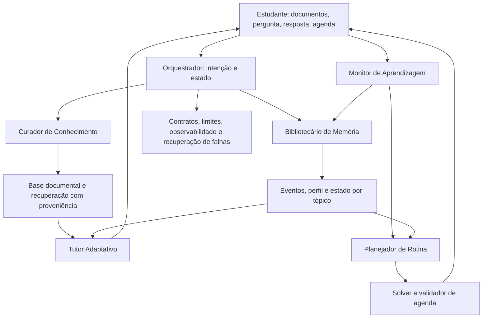

# Etapa 1 — Esqueleto conceitual do EduAgent-OS

## 1. Escopo e premissas

A fonte normativa de escopo é `fase1/fase1_proposta.pdf`, conferida com seu fonte LaTeX. O recorte é graduação, interação textual em português, documentos e PDFs fornecidos pelo estudante, recursos complementares existentes, exercícios, flashcards, memória entre sessões e planejamento semanal. ODS principal: 4. Inferência, recuperação e armazenamento são locais; rede é opcional para curadoria e agenda. Não há notas oficiais, geração de vídeos, treinamento fundacional nem integração acadêmica fechada.

Este desenho é uma proposta de implementação, não uma demonstração de superioridade. A hipótese é que separação de responsabilidades, contratos verificáveis e memória seletiva melhorem continuidade e consistência sob orçamento local. A comparação com um agente único deve usar as mesmas ferramentas, dados e limites de recursos.

## 2. Princípio arquitetural

Cinco agentes lógicos compartilham um modelo local, mas recebem instruções, dados e permissões diferentes. A coordenação é um grafo explícito, não uma conversa irrestrita entre agentes. Componentes determinísticos validam decisões produzidas pelo LLM. Agentes não escrevem diretamente em todos os armazenamentos nem escolhem livremente seus destinatários.

## 3. Responsabilidades e fronteiras

| Agente | Responsabilidade | Artefato produzido | Fronteira |
|---|---|---|---|
| Curador | Ingerir, identificar estrutura, recuperar e selecionar fontes | Manifesto, tópicos, candidatos a prazos, pacote de evidências | Conteúdo recuperado não é instrução executável; datas incertas exigem confirmação |
| Tutor | Explicar, perguntar, oferecer pistas e propor prática | Turno pedagógico, exercício, flashcard | Não infere domínio definitivo nem altera agenda |
| Monitor | Avaliar respostas segundo gabarito/rubrica e registrar incerteza | Evidência formativa e recomendação | Não emite nota institucional; não transforma autorrelato em prova de domínio |
| Planejador | Traduzir necessidade pedagógica em demanda temporal | Proposta e justificativa de agenda | Viabilidade é decidida por solver e verificador, não pelo texto do LLM |
| Bibliotecário | Consolidar e recuperar fatos com origem e temporalidade | Contexto relevante e estado versionado | Resumos são derivados; originais permanecem consultáveis |

## 4. Ciclo mínimo

1. Capturar documentos, disciplina, avaliações, compromissos e disponibilidade.
2. Extrair e validar fatos; confirmar ambiguidades antes de torná-los restrições oficiais.
3. Recuperar fontes e histórico pertinentes ao tópico, sob orçamento de contexto.
4. Tutor apresenta atividade; estudante responde; Monitor aplica critérios explícitos.
5. Persistir evidência, atualizar estimativa e propor revisão quando necessário.
6. Solver organiza blocos; estudante recebe proposta viável ou diagnóstico de conflito.
7. A próxima sessão usa o estado atualizado; ferramentas externas só recebem ações confirmadas.

O fluxo tem terminais explícitos: resposta, pedido de esclarecimento, espera por resposta do aluno, conflito de agenda, falha controlada e cancelamento. Esperar o aluno não equivale a continuar gerando chamadas.

## 5. Camadas transversais necessárias

- Contratos tipados e IDs estáveis de disciplina, tópico, documento, evento e tarefa.
- Separação de dados brutos, fatos confirmados, inferências e artefatos publicados.
- Recuperação documental distinta da memória do estudante, ambas com proveniência.
- Skills versionadas, selecionadas por tarefa, com pré-condições e critérios de término.
- Validação estrutural, validação de domínio e conferência independente de efeitos externos.
- Checkpoints, transações, idempotência, timeout, limites de chamadas e cancelamento.
- Registro de custo, latência, erros, delegações e versão de cada componente.
- Avaliação em camadas: artefatos, fluxos completos, continuidade e injeção de falhas.

## 6. Questões ainda abertas nesta etapa

Escolha verificável e configuração do Bonsai 2; extração/OCR; granularidade dos tópicos; busca híbrida e reranking; tratamento de datas; rubricas e estimador de domínio; recuperação/compactação da memória; formalização do solver; ferramentas e suas permissões; limites operacionais; dataset e métricas. Essas lacunas são enumeradas na etapa 2 e resolvidas metodologicamente nas etapas 3–4.

## 7. Referências de partida

As referências abaixo constam da proposta; sua verificação e análise de adequação serão registradas na etapa 3 e na auditoria final, antes de entrarem no relatório.

- Hong et al. MetaGPT, ICLR 2024. https://arxiv.org/abs/2308.00352 — papéis e artefatos estruturados; transferência para educação é uma adaptação.
- Sun e Tai. MultiTutor, PMLR 273, 2025. https://proceedings.mlr.press/v273/sun25a.html — cooperação educacional, sem estabelecer eficácia deste projeto.
- Packer et al. MemGPT, 2023. https://arxiv.org/abs/2310.08560 — hierarquia de memória, não validação de um modelo pedagógico.
- Wang et al. Voyager, 2023. https://arxiv.org/abs/2305.16291 — biblioteca de habilidades em outro domínio; não prova benefício de compactar prompts.
- Gou et al. ToRA, ICLR 2024. https://arxiv.org/abs/2309.17452 — uso de ferramentas verificáveis; solver de agenda é uma escolha de engenharia própria.
