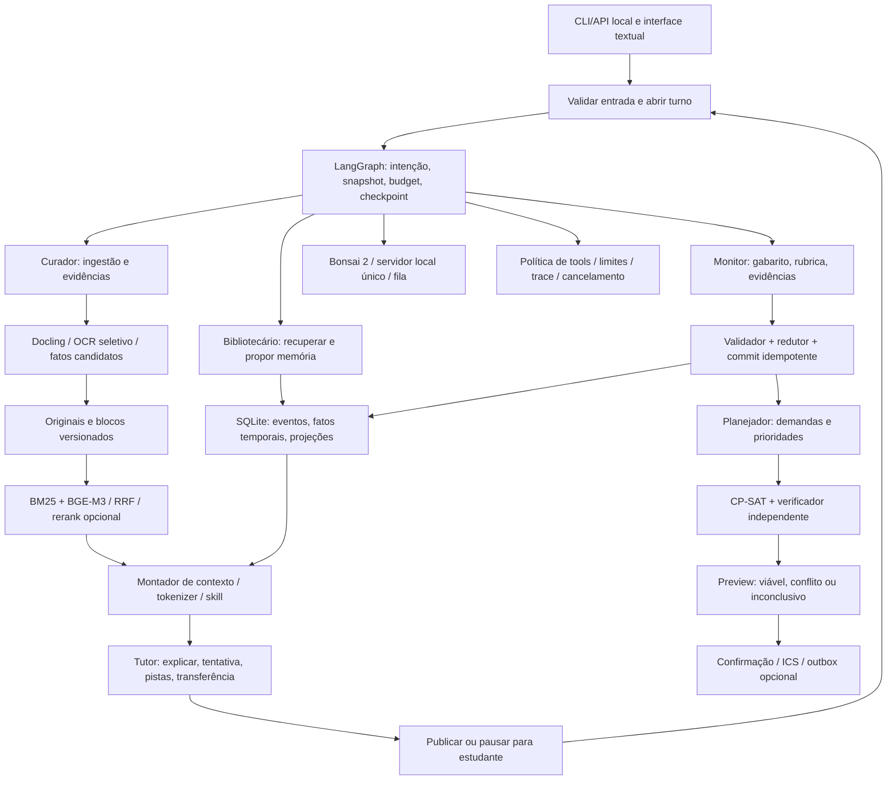

# Etapa 4 — Especificação implementável do EduAgent-OS v0.1

## 1. Estatuto, escopo e decisões normativas

Este documento é autocontido para implementar o núcleo textual local. “Deve” é contrato de implementação; valores numéricos são defaults de ensaio, sujeitos a calibração antes do congelamento experimental. Não são resultados já medidos. O MVP contempla cinco agentes lógicos, ingestão PDF/texto, RAG com citações, tutoria/quiz/flashcards/autoexplicação, evidências formativas, memória temporal e agenda semanal/exportação ICS. Web e sincronização são módulos opcionais com contrato definido abaixo; ausência de credenciais não bloqueia o núcleo. Não há notas oficiais, treinamento fundacional, voz, vídeos gerados ou sistemas acadêmicos fechados. Multiusuário concorrente em rede está fora do deploy inicial, mas os dados são segregados por usuário desde o esquema. Este mapa é normativo para produção e o mapa8 para testes; pesquisas3/7 são fundamentos e registro histórico. O detalhamento da seção15 fecha as decisões verificadas pela auditoria independente e prevalece quando especifica uma regra mais precisa.

## 2. Mapa integrado



## 3. Stack, diretórios e configuração

Implementar em Python 3.11+ com lock; LangGraph, Pydantic v2, Docling, motor OCR configurado, SentenceTransformers/FlagEmbedding, OR-Tools e biblioteca `icalendar`. SQLite de runtime deve incorporar as correções WAL documentadas (3.51.3 ou backport corrigido). Pin de pacotes, modelos auxiliares e binários é resultado do smoke test: registrar versões reais em `manifest.json` e `uv.lock`, não assumir que `latest` é reproduzível.

```text
eduagent/
  api.py cli.py config.py contracts.py graph.py context.py policy.py
  agents/{curator,tutor,monitor,planner,librarian}.py
  services/{ingestion,retrieval,memory,assessment,scheduling,calendar,effects}.py
  storage/{repository,migrations,checkpoints}.py
  skills/{explain,graduated_hint,quiz,flashcard,self_explain}/skill.yaml
  telemetry.py
config/default.yaml
schemas/                         # JSON Schemas exportados dos contratos
data/<user_id>/{originals,derived,indexes,exports}/
data/domain.sqlite data/checkpoints.sqlite
tests/ fixtures/ eval/            # especificação de testes: etapa 8
```

Configuração inicial: `timezone=America/Sao_Paulo` somente após confirmação; `network_enabled=false`; `calendar_sync_enabled=false`; `window=32768`, `max_output_tokens=16384`, `tool_reserve=2048`, `margin=1024`, `doc_tokens=4096`, `memory_tokens=2048`; `max_llm_calls=6`, `max_tool_calls=8`, `max_graph_steps=16`, `max_repairs_total=2`, `max_repair_artifact=1`, `active_deadline_s=120`, `llm_timeout_s=90`; `retrieval_top_k=40`, `rrf_k=60`, `rerank_candidates=40`, `evidence_chunks=6`; `solver_budget_s=10`, `slot_minutes=15`, `horizon_days=7`, `seed=0`, `num_workers=1`. Ingestão: máximo inicial 50 MiB/500 páginas, timeout 600 s por documento, subprocesso limitado a 4 GiB, progresso por página; oversized é recusado ou dividido pelo usuário. Esses limites precisam ser ajustados no hardware registrado.

### 3.1 Modelo

Candidato: `prism-ml/Ternary-Bonsai-2-27B-gguf`, revisão publicada `b072e1d3b35a0a630cece372c2127528e0994386`, arquivo inicial `Ternary-Bonsai-2-27B-PTQ1_0.gguf`, SHA publicado `53107f530aa52eb00912263ab1ee29bd199261c87cd7b4ad4ca1318c1fe33ee3`. Conferir SHA local, licença e NOTICE. Runtime obrigatório do candidato: fork `PrismML-Eng/llama.cpp`; release candidata do demo `prism-b10743-adfffbe`, cuja capacidade deve ser verificada e fixada por hash. Não presumir compatibilidade do stock llama.cpp. Um servidor loopback com um slot e fila de quatro pedidos; sem visão.

Todos os agentes usam o mesmo modelo. Adaptador `generate(messages, schema, sampler, deadline, seed) -> GenerationResult` devolve texto final, contagens, finish_reason e erro tipado; pensamento não é fonte de evidência. Primeiro testar modo non-thinking com sampling publicado `.7/.8/20/min_p=0`; comparar thinking `1/.95/20/.05` em desenvolvimento. Perfil selecionado e suas penalidades/template são congelados no manifesto. JSON schema é solicitado somente se o fork o suportar; parse/schema/política continuam obrigatórios. Se o candidato não carregar ou falhar os gates, marcar `MODEL_NOT_ADMITTED`: seleção de outro modelo é uma revisão explicitamente registrada, não substituição silenciosa. Não iniciar tutoria com modelo não validado.

## 4. Contratos e comunicação

Todos os contratos usam Pydantic estrito, `extra='forbid'`, enums, IDs UUID, datetimes ISO-8601 com zona/UTC e tamanhos limitados. Datas parciais têm tipo específico, não coerção para datetime. Campos `*_ref` contêm ID+versão, não caminho produzido pelo LLM. Payload externo não muda papel/permissões. Exportar schemas como parte do build.

Envelope comum:

```json
{"schema_version":"1.0","task_id":"uuid","trace_id":"uuid",
 "parent_task_id":null,"sender_role":"curator","artifact_type":"EvidencePack",
 "snapshot_version":12,"source_refs":["doc:uuid@2:p3:b7"],
 "payload_ref":"artifact:uuid@1","status":"completed","error":null}
```

Artefatos obrigatórios:

| Tipo | Campos e invariantes |
|---|---|
| `SourceRef` | doc_id, version_id, physical_page≥1, block_id, offsets/bbox, text_hash; resolvível no snapshot |
| `AcademicFact` | entity_id, kind, original_expression, normalized_value, precision, timezone?, source_refs, status `candidate/ambiguous/confirmed/rejected`, authority; confirmado exige confirmação ou entrada direta inequívoca do usuário |
| `EvidencePack` | query, topic_ids, chunks[{id,text,source_ref,rank}], retrieval_config_hash, coverage `supported/partial/none`; não contém instruções de servidor |
| `MemoryPack` | snapshot_version, current_facts, topic_state, events[{id,times,kind,help_level,source}], contradictions, summaries; não mistura usuários |
| `LearningItem` | item_id, family_id, version, topic_ids, prompt, expected_answer_ref, rubric_ref, source_refs, kind, published_at; pergunta e solução separadas |
| `TutorTurn` | skill_id/version, objective, text, item_ref?, hint_level 0..3, citations, next_state; terminal de invocação explícito |
| `Assessment` | attempt_id, item_ref, assessment_revision, supersedes?, criterion_results[{criterion_id,topic_ids,level 0..2,evidence_kind,response_span?,reason,misconception_code?}], correctness `correct/partial/incorrect/undecidable`, help_level, revealed, evidence_ids, reliability `accepted/abstain`, reason; span existe salvo evidence_kind=missing |
| `TopicState` | independent_attempt_ids, assisted_attempt_ids, error_codes, last_attempt_at, status `insufficient/mixed/favorable`, estimate=null no MVP, review_due, model_version, revision |
| `StudyDemand` | demand_id, topic_ids, kind, duration_minutes>0, earliest, deadline, mandatory, dependencies, priority_class 1..3, evidence_ids, duration_status `confirmed/estimated`; restrição dura exige confirmação |
| `ScheduleProposal` | plan_id/revision, snapshot_version, status solver, blocks[{block_id,demand_id,start_utc,end_utc,uid}], unmet_demands, diff, validation, objective/bound, explanation; sem validação não há aprovação |
| `Operation` | operation_id, user_id, action, expected_version, payload_hash, confirmation_ref?, state, receipt_ref?; mesmo ID com digest diferente é erro |

Estado do grafo: `user_id, session_id, turn_id, task_id, trace_id, intent, snapshot_version, artifact_refs, pending_question, pending_item_ref, budgets, deadline, cancel_requested, status, errors`. Checkpoint guarda refs, não PDFs integrais. Estado de domínio é autoridade; checkpoint não substitui commit.

Erros: `SCHEMA_INVALID`, `SOURCE_UNRESOLVED`, `AMBIGUOUS_INPUT`, `VERSION_CONFLICT`, `TOOL_DENIED`, `MODEL_NOT_ADMITTED`, `NO_EVIDENCE`, `RESOURCE_LIMIT`, `TIMEOUT`, `UNKNOWN_EFFECT`, `CANCELLED`, `INTERNAL_FAILURE`. Cada erro tem mensagem ao usuário, retryability e referência de diagnóstico local.

## 5. Dados e armazenamento

DDL lógico (todas as tabelas de domínio têm user_id; FK e constraints habilitados):

```text
users(id PK, timezone, revision)
courses(id PK, user_id FK, title, aliases_json, revision)
topics(id PK, course_id FK, title, aliases_json, revision)
topic_edges(parent_id FK, child_id FK, UNIQUE(parent_id,child_id))
documents(id PK, user_id FK, course_id FK, active_version)
doc_versions(id PK, doc_id FK, sha256, mime, original_ref, extractor_manifest, status)
blocks(id PK, version_id FK, page, order_index, kind, text, bbox_json, diagnosis_json)
chunks(id PK, version_id FK, block_refs_json, text, embedding_manifest)
facts(id PK, user_id FK, kind, value_json, authority, valid_from, valid_to,
      recorded_at, source_refs_json, supersedes FK, status, revision)
events(id PK, user_id FK, session_id, kind, payload_json, occurred_at, recorded_at)
items(id PK, family_id, version, prompt, answer_ref, rubric_ref, source_refs_json)
attempts(id PK, user_id FK, item_id FK, response_event_id FK, help_level, revealed)
assessments(id PK, attempt_id FK, assessor_version, payload_json, UNIQUE(attempt_id,assessor_version))
topic_states(user_id, topic_id, revision, payload_json, PRIMARY KEY(user_id,topic_id))
summaries(id PK, user_id FK, source_event_ids_json, claims_json, verification, revision)
demands(id PK, user_id FK, payload_json, status, revision)
plans(id PK, user_id FK, revision, snapshot_version, payload_json, approval_ref)
logical_blocks(id PK, user_id FK, uid UNIQUE, revision, remote_id, etag)
operations(id PK, user_id FK, digest, state, expected_version, receipt_json)
outbox(id PK, operation_id FK UNIQUE, target, payload_json, lease_until, state)
confirmations(id PK, user_id FK, artifact_id, artifact_revision, digest, occurred_at)
schema_migrations(version PK, applied_at)
```

SQLite WAL/FULL, escritor serializado e transações curtas. Todo estado mutável valida revisão esperada. Guardar eventos brutos para auditoria, mas permitir exclusão explícita de payloads pessoais. Índices/resumos/projeções são reconstruíveis. Deleção propaga a todos os derivados, checkpoints e traces; backups têm política de expiração e catálogo de tombstones sem payload para impedir ressurreição. Não manter hash reversível de texto excluído. Backup inicial deve fechar escritores/checkpointer, consolidar e copiar um conjunto consistente com originais/manifesto. Restaurar em diretório novo e rodar verificador de integridade/replay.

## 6. Ingestão, ontologia e RAG (Curador)

1. Validar ownership, MIME por bytes, limites e path canônico; arquivar original e SHA. Duplicata exata reaproveita bytes, preservando vínculos por disciplina. Nova versão não ativa antes da indexação completa.
2. Docling produz blocos ordenados, tabelas e proveniência; páginas vazias/ruidosas são diagnosticadas. OCR seletivo `por`/`por+eng`, derivado separado; reextrair documento inteiro. Equações/tabelas não legíveis ficam pendentes. Nunca usar apenas sidecar OCR como texto total.
3. Curador extrai tópicos e fatos candidatos por schema. Validar datas/números com texto de origem; datas relativas usam data da fala e zona confirmada. PDD confirmado tem prioridade, mas uma revisão gera conflito a reconciliar. Prazo só de dia não ganha horário automaticamente. Detectar ciclos de pré-requisito. O usuário confirma ou corrige a tabela extraída.
4. Chunking por seção/bloco: alvo 384 tokens do embedding, overlap até 64 quando continuidade requer; IDs e todas as páginas de origem preservados. Tabela repete cabeçalhos e referencia células/blocos corretos.
5. Índice lexical BM25: implementação `rank_bm25.BM25Okapi`, parâmetros iniciais `k1=1.5,b=.75`, tokenização Unicode lowercase/NFKC sem remover termos técnicos e códigos; versão/hash do tokenizer registrados. Busca densa: BGE-M3 local, revisão/hash fixados no download, vetor normalizado e produto interno exato no MVP. Arrays NumPy por snapshot evitam dependência de serviço; persistir mapeamento chunk→vetor. ANN/Qdrant é extensão para corpus maior, exige medição de recall ANN.
6. Filtrar usuário, disciplina e versão antes de ranking; lexical/denso top-40; RRF `Σ1/(60+rank)` com rank 1-based, empate pelo ID. Reranker `BAAI/bge-reranker-v2-m3` opcional, pares no máximo 512 tokens, top-40→até6; registrar truncamento. Configuração inicial sem reranker se co-residência inviável; seleção em validação.
7. Pacote até 4.096 tokens Bonsai. Fonte `[doc_id@version:página:bloco]` resolve ao original; citar várias páginas quando necessário. Validator confere IDs, offsets e versão. Apoio semântico é avaliado separadamente; existência de citação não garante que sustenta a afirmação.
8. Sem resposta documental, declarar ausência de evidência; explicação geral deve estar rotulada e não receber citação fictícia. Limiar de abstinência ajustado em validação, não sigmoid tratado como probabilidade.

Curadoria web opcional: interface `search(query, language, max_results)->candidates` e `fetch(url)->resource`. Até5 candidatos/3 fetches, 10s/5MiB, dois redirects com revalidação. Estados `metadata_only/text_read/transcript_read/unavailable`, URL final, data/hash e fonte. Vídeo sem transcrição só pode ser recomendado por metadados, não resumido. Conector de busca deve ser escolhido/configurado em implementação; sem ele, `CONNECTOR_DISABLED`. Cache offline é marcado com data, não fingido como consulta atual.

## 7. Memória e contexto (Bibliotecário)

Eventos mantêm `occurred_at` e `recorded_at`; fatos mantêm validade e supersedes. Origem: `observed/asserted/inferred`. Preferência declarada não é evidência de aprendizagem. “Atual” recupera projeção vigente e correções; “como mudou” recupera versões em ordem temporal. Contradição não conciliada devolve ambos os registros e pendência.

Recuperação: filtros usuário/disciplina/tópico/tempo → busca lexical+densa de rounds/eventos → até8 originais em 2.048 tokens + fatos atuais obrigatórios; correções relevantes podem substituir candidatos. Não permitir que similaridade reative fato superseded como atual. Consulta de evidências antigas pode explicitamente trazer versões anteriores.

Contexto contado após template/serialização: `input + 16384 + 2048 + 1024 ≤ 32768`. Ordem de montagem: instrução e schema → skill → tarefa/item/rubrica → âncoras/fatos confirmados → fontes → memória → turnos recentes. Entrada máxima 13.312 tokens. Reduzir fontes periféricas/segmentar antes de resumir; jamais remover rubrica necessária e continuar avaliando. Síntese nasce de originais, com claim→event_ids, cobertura temporal e verificação. Checar exatamente datas, números, polaridade, ajuda e estado; falha mantém originais selecionados ou pede divisão. Não encadear indefinidamente resumo de resumo. Publicar síntese derivada, nunca apagar evento por compactação.

## 8. Tutoria, monitor e aprendizagem

Tutor estados: `explain`, `attempt`, `hint`, `self_explain`, `transfer`, `close`; um turno principal por chamada, terminal `waiting_student` quando pede resposta. Intenção direta recebe explicação direta. Para prática, criar item com fonte e gabarito/rubrica prévia, separar solução; revelação explícita é registrada. Pistas 1=conceito, 2=próximo passo, 3=exemplo análogo; após três, oferecer solução comentada ou encerramento. Pedido de solução, recusa e cancelamento encerram sem insistência. Transferência usa família identificada, não conta mera cópia como aprendizagem independente.

Skills YAML: `id, version, tasks, input_schema, preconditions, steps, allowed_tools, output_schema, postconditions, stop_conditions, max_calls, cases`. Catálogo obrigatório: explicar, pistas, quiz, flashcard, autoexplicação. Hash/version registrados. Alterações de skills só por revisão offline, não autoedição ao vivo. Flashcard pergunta/verso separados, conceito atômico e indicação de fonte; revisão inicial 1/3/7 dias é política configurável.

Monitor recebe enunciado, resposta original, referência, critérios, ajuda e fonte, nunca a autovalidação do Tutor. Itens determinísticos usam exatidão/tolerância explícita e unidades; código somente em sandbox dedicado se extensão habilitada. Texto usa rubrica por critério 0=incorreto/ausente, 1=parcial, 2=adequado, span de resposta e misconception_code. Span inventado, item ambíguo, ausência de fonte ou divergência formal resultam em abstinência. Feedback pode ser útil sem atualização inferencial.

Redutor determinístico aceita apenas Assessment válido, uma vez por attempt_id. Mantém independentes/assistidas, erro, datas e revisão. MVP: `estimate=null`; zero evidência=`insufficient`; demais casos=`mixed`; `favorable` provisório exige três tentativas mais recentes **independentes, aceitas e decidíveis** no tópico, todas corretas e de famílias distintas, depois do último erro crítico aceito. Erro crítico é critério marcado `critical=true` na rubrica com nível0; resposta parcial não conta como correta. Um novo erro crítico volta a mixed e pede revisão, mesmo assistido. Uma nova tentativa independente parcial/incorreta também interrompe a sequência favorável. “Recentes” significa ordem cronológica das tentativas, não janela de dias; idade é informada à parte. Tentativas assistidas corretas não removem erro crítico nem compõem a sequência. `favorable` não equivale a domínio; ausência de prática torna evidência antiga, não um erro fictício. Eventos de leitura/autorrelato não atualizam competência. BKT é módulo futuro em shadow mode, ajustado em logs separados, com p0/T/G/S e previsão `p(1−S)+(1−p)G`; somente adotado após calibração prospectiva. Não inventar priors cognitivos.

Replanejamento: erro aceito, tarefa perdida ou alteração confirmada gera `review_request`; a duração recomendada é explicitamente estimada e confirmada quando virar obrigatória. Agendar sugestão opcional enquanto não confirmada é permitido; não converter incerteza em obrigação.

## 9. Planejamento e exportação

Interpretar demandas, confirmar durations/prazos/compromissos e construir horizonte de sete dias. UTC para comparação, zona IANA para janelas locais. Slots de15min: arredondar disponibilidade para dentro e bloqueios para fora; duração ocupa `ceil(duration/15)` slots, sem reduzir minutos. Datas sem hora exigem confirmação. Hora local inexistente/ambígua deve ser esclarecida. Compromissos, blocos iniciados e concluídos são fixos.

Para cada demanda gerar candidatos contíguos respeitando earliest/deadline/janelas. `x_b∈{0,1}`; obrigatória `Σ_b∈i x_b=1`; opcional `≤1`; por slot `Σ_b cobrindo t x_b≤1`; limites diários confirmados; precedência `end_i≤start_j` quando ambos presentes. Requisito prévio obrigatório não pode ser omitido enquanto dependente selecionado: `presence_j≤presence_i`. Dependência cíclica é erro, não inviabilidade misteriosa.

Objetivos lexicográficos: maximizar opcionais classe1, depois2, depois3; minimizar número de blocos futuros alterados; minimizar deslocamento em slots; preferências como desempate. Dividir dez segundos totais entre solves, fixar valor anterior só se OPTIMAL; se houver FEASIBLE parar e publicar viável sem prova de lexicografia ótima. Sem solução UNKNOWN é inconclusivo; INFEASIBLE é conflito provado para modelo; MODEL_INVALID é defeito. Nunca publicar relaxação diagnóstica como plano aprovado.

Verificador **separado** reaplica restrições em minutos/instantes originais, não apenas a matriz de slots; valida demanda, conflitos, precedência, imutabilidade e snapshot. Preview inclui adições/movimentos/remoções, déficit e razões de evidência. Confirmação vincula plan_id/revision/digest; alteração posterior invalida confirmação.

ICS por `icalendar`: VCALENDAR VERSION2.0/PRODID, VEVENT UID/DTSTAMP/DTSTART/DTEND/SUMMARY, UTF-8/CRLF/folding; UTC Z para início/fim, fim exclusivo. Exportação simples **sem METHOD**: UID UUID estável por bloco lógico, CREATED de criação, DTSTAMP/LAST-MODIFIED da última revisão persistida e SEQUENCE da revisão; retries/reexportações da mesma revisão não alteram timestamps. Esse ajuste foi identificado pela pesquisa da etapa7 e segue RFC5545 §3.8.7.2. All-day usa DATE e fim exclusivo no dia seguinte. Parser independente valida round-trip. Importador manual pode duplicar apesar de UID: não prometer dedup universal.

Sync opcional via MCP deve expor `read/create/update/delete` com IDs/precondições. Outbox somente após confirmação. CalDAV: href estável, criação If-None-Match:*, atualização If-Match ETag. Google: ID próprio de criação conforme backend; update/delete condicional só habilitados depois de verificar documentação específica. Timeout→unknown_effect→read/reconcile; não repetir cegamente. Alteração externa→conflito e novo preview. Se conector não preserva leitura, IDs e versão, manter ICS/preview e declarar não admitido.

## 10. Grafo e ferramentas

Intenções: `ingest`, `ask`, `practice`, `submit_answer`, `plan`, `replan`, `approve_plan`, `update_activity`, `memory_query`, `correct_fact`, `delete_data`, `export_calendar`, `curate`, `cancel`. Comandos explícitos prevalecem; classificador LLM retorna enum validado e, em ambiguidade, pergunta antes de efeito. Rotas:

```text
ingest -> extract -> curator_facts -> validate -> confirm_if_needed -> commit/index -> finish
ask/practice -> snapshot -> curator_retrieve + librarian_retrieve -> context -> tutor -> validate -> publish/wait
submit_answer -> resolve_pending_item -> monitor -> validate -> commit -> feedback -> optional_review_request -> finish
plan/replan -> snapshot -> planner_demands -> confirm_if_needed -> solver -> independent_check -> preview -> wait
approve_plan -> validate_revision/digest -> commit_confirmation -> finish
update_activity -> validate_transition/time -> commit_event -> optional_replan -> finish
export_calendar -> resolve_approved_plan -> render_ics -> validate -> publish [-> confirmed_outbox]
memory_query -> librarian_retrieve -> source_check -> answer -> finish
correct_fact/delete_data -> validate_scope -> preview -> confirm -> commit/invalidate -> finish
curate -> network_gate -> search/fetch -> curator_rank -> validate_access_claims -> finish
cancel -> stop_dispatch -> reconcile_started_effects -> persist -> cancelled
```

Cada `+` representa leitura independente de snapshot comum; geração usa fila serial. Checkpointer SQLite persistente, `durability=sync`, thread_id por sessão. Interrupt retoma nó desde início: preparação é pura, efeitos estão em nós idempotentes separados. Espera por aluno é fim da invocação e nova entrada retoma o item, sem timeout ativo durante espera.

| Ferramenta | Quem pode propor | Pré-condição | Validação/resultados |
|---|---|---|---|
| `document.extract` | Curador | arquivo autorizado/job | limites, diagnóstico, blocos |
| `document.search` | Curador/Tutor | snapshot e disciplina | ownership, citações, filtros |
| `memory.query` | Bibliotecário | usuário/tópico/tempo | versão e correções |
| `assessment.check` | Monitor | item/rubrica válidos | unidade/tolerância e spans |
| `schedule.solve` | Planejador | demanda/agenda confirmadas | status e independente check |
| `calendar.render` | Planejador | plano válido | parser e equivalência |
| `web.search/fetch` | Curador | rede habilitada | destino/conteúdo/quota |
| `domain.commit` | serviço determinístico | proposta válida+expected_version | atomicidade/dedup |
| `calendar.apply` | dispatcher determinístico | confirmação atual | ID/ETag/reconciliação |

Nenhum agente recebe shell genérico ou escrita direta no DB. MCP é adaptador allowlisted de ferramentas; A2A é extensão distribuída, não obrigatório. Fonte/tool result é dado rotulado e não altera política. Resolver paths/ownership e bloquear traversal/symlink escapes; fetch bloqueia IP privado/loopback, revalida redirects/DNS. JSON correto para ação proibida é negado por código. Divergência com solver/fato confirmado não é resolvida por votação: esclarecimento ou falha controlada.

## 11. Commit, efeitos e recuperação

`commit(operation_id,digest,expected_version)` abre transação curta, confere identidade/permissão e **primeiro verifica operation_id**: mesmo ID+digest+usuário devolve recibo anterior mesmo que expected_version agora seja antiga; digest/usuário diferente falha. Para operação nova, confere revisão esperada, insere evento/operação/outbox e atualiza projeção; commit atômico. Não manter transação durante LLM/rede. Checkpoint em DB separado não é atômico: replay consulta operação autoritativa e reutiliza recibo. Publicação de índice só após construção completa.

Dispatcher com lease processa outbox; crash antes de commit não promove estado; após commit recupera pendente; após efeito antes de ACK reconcilia destino por identidade. Efeito desconhecido sem consulta possível permanece `UNKNOWN_EFFECT`, sem retry automático. Entrega pode ser ao menos uma vez; não há promessa de exactly-once distribuído.

## 12. Limites, observabilidade e entrega

Antes de cada node/tool/geração, conferir cancelamento, deadline e budget; reparo consome chamada e contador. Ao esgotar: terminal com erro e artefatos já válidos, nunca saída parcial silenciosamente aprovada. Fila cheia responde RESOURCE_LIMIT. Job de ingestão é cancelável e indica páginas concluídas/pêndencias; versão incompleta não vira ativa.

Trace local por turno e spans de fila/LLM/retrieval/context/solver/commit/tools. Registrar versões, seed/sampling, counts entrada/raciocínio/saída quando disponíveis, status/truncamento, tempo ativo/fila/total, RSS/VRAM e erros. Não logar payload pessoal completo por padrão. Métricas desconhecidas ficam null com razão, nunca zero. Custo local: tokens/segundos/energia quando medidos e amortização documentada; custo API apenas se conector pago usado.

CLI mínima: `doctor`, `ingest`, `ask`, `practice`, `submit`, `plan`, `approve`, `export`, `resume`, `cancel`, `trace`, `backup`, `restore`, `delete`. API loopback com endpoints POST `/turns`, `/turns/{id}/resume`, `/turns/{id}/cancel`, GET `/artifacts/{id}`, `/health`; escrita exige contexto de usuário autenticado localmente. Exit codes:0 sucesso/espera legítima,2 entrada ambígua/inválida,3 recurso/conector indisponível,4 falha interna; JSON sempre contém status.

## 13. Sequência de implementação e aceite

1. Manifesto/hardware e gate de modelo: carregar offline, tokenizer, JSON e ferramentas negadas.
2. Schemas/repositório/migrações e commit idempotente; validar crash/replay.
3. Ingestão/OCR/proveniência; ouro de páginas/tópicos/datas; confirmação.
4. RAG lexical/denso/RRF, citação resolvível e abstinência; escolher reranker em validação.
5. Skills/tutor/monitor e redutor observado; validar rubricas humanas.
6. Memória temporal e contexto com checagem de síntese; correção/deleção.
7. Solver e verificador independente; ICS/preview/confirmação.
8. Grafo completo, checkpoints/pausas/limites/traces; ensaio longitudinal e offline.
9. Conectores opcionais admitidos individualmente após contratos e falhas de rede.
10. Congelar manifesto, executar baselines/ablações e emitir relatório de testes conforme etapa8.

Aceite funcional: cada rota termina, cada artefato cumpre contrato, toda citação resolve, toda escrita tem recibo/versionamento, nenhum plano inválido é publicado, uma sessão retomada preserva item/ajuda/histórico. Critérios quantitativos e dados de teste são especificados autonomamente no mapa de testes; ausência de resultados experimentais não deve ser preenchida com estimativas inventadas.

## 14. Referências e alcance

Arquitetura por papéis: MetaGPT (Hong et al., arXiv:2308.00352, versão2024), MultiTutor (Sun/Tai, PMLR273,2025). Memória: MemGPT (arXiv:2310.08560), LongMemEval (arXiv:2410.10813). Skills: Voyager (arXiv:2305.16291). Tutoria: Chi et al. (1994), DOI10.1207/s15516709cog1803_3; Roediger/Karpicke (2006), DOI10.1111/j.1467-9280.2006.01693.x. Rubricas: Prometheus (arXiv:2310.08491). BKT opcional: pyBKT (arXiv:2105.00385). RAG: M3 (arXiv:2402.03216); RRF (DOI10.1145/1571941.1572114, metadados conferidos), docs Qdrant e model card BAAI. Ferramentas: ToRA (arXiv:2309.17452). Calendário: RFC5545 e RFC4791. Documentação: model card Prism ML, LangGraph Checkpointers/Interrupts, DoclingDocument, OCRmyPDF cookbook, Pydantic Strict Mode, SQLite WAL, MCP2025-11-25, OpenTelemetry Traces e OR-Tools CP-SAT. Fontes consultadas em30/09/2026; fontes móveis exigem pin. Métodos foram adaptados, não conferem automaticamente eficácia ao sistema integrado.

## 15. Fechamento operacional após auditoria independente

### 15.1 Snapshot, ownership e invalidação

Adicionar `users.domain_revision` monotônica. Toda operação nova que muda dados de domínio incrementa esse contador na mesma transação; retries não incrementam. `expected_version` e `snapshot_version` são esse contador. Snapshot é materializado em transação de leitura curta: fatos/agenda/projeções/versões ativas/ref hashes necessários copiados para artefato imutável; os agentes não mantêm uma conexão aberta nem hidratam silenciosamente a versão atual. Acesso ao snapshot mantém ownership. Índices versionados consultam exatamente as versões ali listadas. Qualquer escrita nova após leitura exige reload para próximo commit; no MVP esse controle conservador é por usuário, mesmo para mudanças sem relação com a tarefa.

Preview fica ligado à revisão de domínio; aprovação confere revisão/digest. Confirmação guarda `base_revision`, `approval_revision` pós-commit e conjunto/hash das dependências. Antes de criar nova outbox exige domínio igual à `approval_revision`; confirmação/outbox conjunta pode ocorrer no mesmo commit. Dispatcher distingue operação já confirmada de nova proposta e, antes de envio, valida que nenhuma restrição/atividade dependente mudou. Receipt/lease/trace são metadados operacionais, não incrementam domain_revision. Mudança em dependência invalida aprovação ainda não aplicada; efeito já aplicado requer novo diff e confirmação, nunca undo silencioso.

Todas as tabelas pessoais possuem ownership direto ou FK composto `(user_id,id)` para pai; eventos/items de usuário incluem user_id. Arestas de tópicos exigem mesmo dono/curso. Criar `artifact_dependencies(user_id, child_ref, parent_ref, relation)` com relações `derived_from/corrects/supersedes`, indexadas nos dois sentidos. Correção/exclusão percorre dependentes, invalida versões publicadas e reconstitui projeções. Fonte compartilhada tem vinculação por usuário; exclusão de vínculo não apaga bytes que outro dono mantém autorizado.

Backup local: retenção proposta30dias, exclusão ativa imediata na aplicação e backups identificados como pendentes até expiração; se backup contém apenas usuário excluído, remover backup já na solicitação. Tombstone sem payload é aplicado **antes** de liberar restore ao SUT. CLI mostra escopo/prazo, sem alegar sanitização forense. Expiração deve ser verificada por job/manual doctor com relógio e catálogo.

### 15.2 Rubrica por tópico, omissão e revisão de julgamento

`RubricCriterion`: id, topic_ids (não vazio), níveis0/1/2, critical, accepted_equivalences, evidence_refs. `evidence_kind=present` requer offsets válidos na resposta; `missing` exige span=null e descrição do critério ausente; `undecidable` não atualiza competência. Não inventar span para silêncio. Avaliação por tópico usa somente seus critérios: todos nível2=correct; todos0=incorrect; mistura=partial; qualquer indecidível essencial=undecidable; erro crítico se algum critério critical tem nível0. Critério de múltiplos tópicos deve ser decomposto pelo autor da rubrica se não permitir atribuição separada, senão a tentativa multicomponente não atualiza estado desses tópicos.

Tentativa tem `occurred_at` e `attempt_ordinal` atribuído no commit, desempate por ordinal; assessment tardio não muda a ordem de tentativa. Independente significa hint_level0, sem reveal nem acesso prévio à solução daquela família **na sessão corrente**; exposição em outra sessão é informada como revisão, não automaticamente ajuda atual. Assessment vigente é maior `assessment_revision` explicitamente aceito, com supersedes e evento de correção; uma nova versão recalcula projeção desde eventos, não aplica segunda atualização cumulativa. Unicidade lógica `(attempt_id,assessment_revision)`, não apenas versão do modelo. O rótulo favorable usa por tópico exatamente a regra da seção8 após correções vigentes. Sua sequência é recalculada após assessment atrasado/corrigido.

### 15.3 Política evidência→demanda v1

Criar `assessment_review_policy_v1`, sempre registrada em demanda/review_due:

- Tentativa aceita incorreta/parcial ou erro crítico: uma revisão sugerida no próximo dia local com disponibilidade; se não existir, primeira data disponível no horizonte. Acerto independente: candidatos de recuperação em1/3/7dias a partir da ocorrência local. Mantém-se no máximo uma demanda pendente por `(user,topic,activity_kind,due_local_date,policy_version)`; retry não gera novas.
- Referência a avaliação confirmada vem de relação `assessment_topics`; prazo pedagógico de revisão é o menor entre due sugerido e início confirmado da avaliação. Se avaliação tem dia sem hora, sugerir antes desse dia sem promover datetime duro; confirmação resolve. Revisão vencida mantém due original e busca primeiro bloco futuro, indicando atraso. Revisão além de sete dias fica pendente para próximo horizonte.
- Prioridade opcional classe1: avaliação em até48h ou erro crítico; classe2: avaliação em até7dias, revisão vencida ou dificuldade recorrente (dois erros aceitos em famílias distintas entre as últimas5 tentativas no tópico); classe3: demais revisões. Ausência de avaliação não inventa urgência. Prioridade é política de ensaio, não inferência de retenção ótima.
- Duração: valor informado/confirmado prevalece; na ausência, catálogo inicial estimado `practice=30min`, `review=15min`, `flashcard=15min`; rótulo estimated e mandatory=false. Usuário pode editar e confirmar para obrigatória. Não converter percentual de domínio em duração. Demanda duplicada é consolidada com todas evidence_ids e regra de prioridade mais alta.
- Planejador LLM pode explicar ou propor alteração, mas o serviço aplica política determinística e exige confirmação para mudança de dura. Avaliar pertinência separadamente da aderência à política. `review_due` é data do primeiro candidato pendente, não uma probabilidade de esquecimento.

### 15.4 Atividades e dependências

`ActivityUpdate(block_id,status,occurred_at,expected_version,operation_id)` segue `planned→started→completed` ou `planned→missed/cancelled`; complete direto de planned aceita início/fim reais informados; sair de completed exige correção explícita, não transição ordinary. missed é declaração do aluno ou sugestão de atraso confirmada; scheduler não presume falta por relógio. Started bloqueia intervalo aprovado; se sessão continua além do fim previsto, pedir atualização de término antes de solver e registrar conflito até esclarecimento. `approve_plan` valida preview atual; ambos retornam recibo e podem disparar replan uma vez por evento.

Dependência temporal referencia demanda/atividade, não ID de tópico. Pré-requisito pedagógico de tópico é informação para recomendação; só vira dependência de atividade quando explicitada/confirmada. Predecessor concluído satisfaz presença com término real; iniciado ocupa fixo e dependente espera término confirmado; pendente fora do horizonte bloqueia dependente com razão. Fixos inseridos uma vez no conjunto de ocupação, sem candidatos móveis. Tarefa indivisível por default; decomposição só após demanda pai declarar `splittable`, número/duração de subtarefas e soma≥duração original, confirmados pelo usuário.

### 15.5 Grade, objetivos e identidade de blocos

Horizonte: da meia-noite local da data inicial confirmada até meia-noite local após7datas, convertidas individualmente para UTC. Grade por dia local a partir de00:00, com política de rejeitar instantes locais ambíguos/inexistentes até confirmação; candidatos não atravessam meia-noite no MVP. Capacidade diária mede **minutos efetivamente reservados**, inclusive arredondamento e blocos fixos de estudo, não duração nominal. Compromissos pessoais bloqueiam tempo mas não contam como estudo diário. Inviabilidade deve ser apresentada como “inviável na grade conservadora de15min; viabilidade contínua não determinada”.

Identidade de ocorrência é `activity_occurrence_id` persistido ao criar demanda; block_id e UID permanecem em mudança de horário. Nova ocorrência recebe novo ID. Persistir em logical_blocks: created_at, modified_at, event_sequence, summary, value_type, source_demand_id e actual_start/end. SEQUENCE começa0 e incrementa apenas se campos de evento mudam, não porque outra parte do plano mudou. Diff usa identidade; remoção no ICS é ausência na exportação, não comando remoto de delete; remoto só remove com operação confirmada.

Objetivo final preferences é soma do overlap em minutos dos blocos com janelas preferidas declaradas pelo aluno; nenhuma preferência=0. Alterações contam block_id futuro previamente aprovado removido ou com instantes diferentes, novas adições separadas. Deslocamento é soma |novo_start−antigo_start|/15min sobre IDs mantidos; removidos penalizados antes pelo número de alterações.

Guardar incumbent validado após cada etapa. Alocar tempo `remaining_seconds/remaining_stages`, usar tempo restante não consumido nas próximas. Se primeira fase sem solução→UNKNOWN; se posterior UNKNOWN→publicar incumbent da fase anterior como FEASIBLE com vetor de provas por etapa. FEASIBLE numa fase interrompe lexicografia e conserva solução válida; fixar objetivo só se OPTIMAL. Verificação independente ainda obrigatória.

### 15.6 Rastreabilidade à proposta

Preservados: graduação, cinco agentes, textual/local, RAG, tutoria, memória e agenda adaptativa. Ajustes: estimativa probabilística de domínio adiada a BKT shadow; A2A distribuído adiado; ICS obrigatório e sync opcional. Experimento de skills deve medir tanto seleção do catálogo quanto **mesma skill completa versus reduzida**, sem trocar tarefas/tools. Sucesso de delegação=artefato válido da versão esperada entregue e consumido pelo destinatário correto / delegações elegíveis tentadas; destinatário e consumo aparecem no ledger, falhas ficam no denominador.
