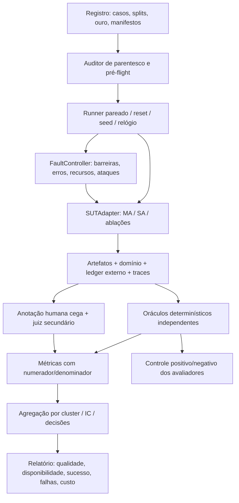

# Etapa 8 — Especificação implementável do sistema de testagem

## 1. Objetivo e interface do sistema avaliado

Este documento define autonomamente o testbed do EduAgent-OS v0.1. O sistema sob teste (SUT) é local: cinco agentes Curador/Tutor/Monitor/Planejador/Bibliotecário em LangGraph, um LLM Bonsai2 compartilhado, documentos versionados, RAG lexical+denso, eventos/projeções SQLite, monitor por rubrica, memória bitemporal, solver CP-SAT, ICS e efeitos opcionais em outbox. O testbed também suporta baseline de agente único com o mesmo modelo/dados/tools e ablações sem memória, sem compactação e com todas as skills.

Interface obrigatória `SUTAdapter`:

```text
initialize(manifest, condition, sandbox_path, clock, seed) -> Handle
load_snapshot(handle, snapshot_ref) -> snapshot_hash
invoke(handle, user_message, user_id, session_id) -> TurnResult
resume(handle, turn_id, response) -> TurnResult
cancel(handle, turn_id) -> Status
read_artifact(handle, artifact_ref) -> Artifact
inspect_domain(handle) -> CanonicalSnapshot
export_trace(handle, trace_id) -> spans
restart(handle) -> Handle
close(handle)
```

TurnResult contém status (`completed/waiting/abstain/conflict/error/cancelled/unknown_effect`), artifact_refs, source_refs, operation_ids, usage e erros. Testbed não lê cadeia de pensamento como oráculo. A inspeção autoritativa é somente do harness, não ferramenta oferecida ao agente. Adaptador SA recebe as mesmas capabilities, sources, memory APIs e limites do MA; diferença é um papel LLM com o mesmo fluxo determinístico de validação/efeitos. MockLLM serve à lógica determinística; não é condição comparativa de qualidade real.

## 2. Mapa e módulos



Python3.11+, pytest, Hypothesis, JiWER, pytrec_eval ou funções de ranking conferidas, scikit-learn e SciPy; `icalendar` é serializer SUT, parser independente candidato `ics.py` no harness, ambos pinados após smoke de conformidade. Se parser candidato não interpretar uma propriedade válida, usar fixture RFC e verificador próprio mínimo, marcando interoperabilidade inconclusiva, não falha automática do serializer. Histórico local inicialmente checado por enumeração em Python; export Porcupine é extensão opcional. Sem exigir Go para fechar o testbed.

```text
eval/
  cli.py registry.py runner.py adapters.py budgets.py clock.py
  faults/{controller,barriers,tool_proxy,process,network,attacks}.py
  oracles/{documents,facts,retrieval,claims,pedagogy,state,memory,
           schedules,ical,effects,traces,bundle,histories}.py
  annotation/{blind_export,import,agreement,adjudication}.py
  metrics/{quality,availability,robustness,cost}.py
  statistics/{clusters,paired_bootstrap,power,multiplicity}.py
  report.py
fixtures/{documents,qrels,items,trajectories,schedules,faults,oracle_controls}/
manifests/{development,validation,test,conditions,experiment}.json
runs/<experiment_id>/{records,artifacts,ledger,traces,annotations,metrics,reports}/
```

## 3. Schemas de registro

JSON Schema estrito; campos extras proibidos; IDs estáveis e refs content-addressed. Arquivos binários/corpus restrito ficam fora de JSONL. Regras de split herdadas por transformações.

### 3.1 CaseRecord

```json
{"schema_version":"1.0","case_id":"CASE-001","family_id":"DOC-04",
 "trajectory_id":null,"cluster_id":"DOC-04","split":"test",
 "requirements":["C04","C06"],"flows":["W02"],"outputs":["O03","O04"],"failures":["F03"],
 "initial_snapshot_ref":"sha256:...","source_refs":["doc:...@1"],
 "script_ref":"sha256:...","gold_ref":"sha256:...","rubric_ref":"sha256:...",
 "answerability":"supported","expected_terminal":"completed",
 "required_predicates":["citations_resolve","claims_supported"],
 "fault_plan_ref":"sha256:...","max_active_s":120}
```

Script contém ações do estudante e precondições de estado/turno, não feedback mutável produzido por outro LLM. Alternativas aceitáveis são enumeradas semanticamente; se SUT faz pergunta não prevista, registrar `SCRIPT_MISMATCH`, não inventar resposta favorável. Simulador LLM opcional é estudo separado, com seeds/modelo e validação do aluno simulado.

### 3.2 GoldRecord

`gold_id, version, authored_by, adjudication_ref, original_refs, critical_facts, entities, relations, qrels, required_claims, accepted_answers, criterion_labels, misconception_codes, temporal_ledger, constraints_original, optimal_vector?, allowed_actions_partial_order, forbidden_actions, expected_effects, expected_terminal`. Os campos não aplicáveis ficam ausentes, não arrays vazios que parecem ouro negativo. Fontes e rubricas privadas do avaliador não entram no índice SUT. Rubrica item inclui `criterion_id, description, levels, critical, evidence_refs`.

### 3.3 RunRecord

`experiment_id, run_id, pair_id, case_id, condition, seed, arm(clean/fault), manifest_hash, initial_snapshot_hash, started_at, active_s, queue_s, terminal, task_completion, safe_terminal, exposure_eligible, trigger_reached, fault_injected, harness_error, output_refs, ledger_ref, trace_ref, resource_ref`. Falha do harness não é falha SUT; ambos ficam no relatório e não são substituídos silenciosamente por novas runs. Plano de repetição técnica é pré-definido.

### 3.4 MetricRecord e AnnotationRecord

Métrica: `run_id, output_id/failure_id, name, oracle_version, numerator, denominator, value, unit, eligible, missing_reason, critical_error_ids, stratum, cluster_id`. `value=null` se indefinida, nunca zero automático. CER/WER podem exceder1; kappa pode ser negativo; log loss pode ser infinita (serializar flag, não JSON Infinity). Anotação: `blind_artifact_id, evaluator_id_pseudonym, rubric_version, dimension/criterion, label, spans, reason, certainty_category, annotated_at`. Mapa blind→run separado e oculto aos anotadores.

## 4. Dataset, splits e clusters

Metas iniciais:24 famílias documentais (8dev/4val/12test),120 queries e120 tentativas por split;30 trajetórias de teste com8 sessões;100 agendas pequenas+100 realistas, splits40/20/40% por família; ≥10 casos base por F01–F24. Não são N comprovadamente suficientes. Documentos de duas disciplinas autorizadas, digital/scan/tabela, português e inglês técnico, versões e queries negativas. Famílias incluem tradução, scan, revisão, paráfrase, variantes de ataque e itens derivados. Não repartir parentes em splits.

Auditor detecta hashes duplicados, similaridade/parentesco e refs de gold presentes no corpus. Humanos revisam candidatos a duplicata sem limiar suposto universal. Registrar grafo documento↔item↔trajetória. Clusters de análise são componentes de parentesco; preferir trajetórias sem fontes compartilhadas entre clusters. Se tal separação produzir poucos componentes, relatar limite e usar análise por componente, sem fingir30 estudantes independentes. Disciplina é estrato, não unidade amostral com N=2 suficiente para generalização.

Anotação: dois especialistas independentes, piloto emdev, acordo antes de adjudicação, terceiro/adjudicador em discordâncias. Normas de texto NFC/whitespace e sinais preservados; ouro de páginas ilegíveis marcado. Datas distinguem dia/datetime, validade/registro e confirmação. Publicar manifestos/IDs e exemplos sintéticos; corpus restrito é entregue por hashes e instruções de acesso autorizado.

## 5. Condições, recursos e runner

Condições: `MA_FULL`, `SA_EQUIVALENT`, `MA_NO_LONG_MEMORY`, `MA_NO_COMPACTION`, `MA_ALL_SKILLS` e contraste adicional `MA_REDUCED_SKILL` (mesma skill/tarefa/tools com instrução reduzida previamente escrita e versionada). Todas usam mesmo modelo/runtime, corpus e permissão, janela32768/reserva16384+2048+1024, até6 LLM/8tools/16steps, reparos2 total/1 artefato, turno ativo120s/geração90s, solver10s total. Valores são ensaio e serão congelados depois do piloto. Para curvas de orçamento, níveis predefinidos de chamadas2/4/6 e entrada operacional8k/13.312 tokens, sem relaxar reserva/janela; relatar tarefas impedidas pelo budget. Contraste reduced usa o mesmo procedimento de não inferioridade proposto para compactação, relatado separadamente.

Seeds principais0..4; falhas com geração0..2; sem geração usa teste determinístico. Separar RNGs do gerador, modelo, controlador e bootstrap. Ordem counterbalanced por bloco de caso/condição, seed fixa do shuffle e registro de warmup/cache. Rodar hardware real em processo único do LLM, sem atividade concorrente não documentada. Teste cold e warm separados, cache política explícita; não cachear saída gerada entre condições.

Algoritmo:

```text
pré-flight: schemas, split audit, hashes, oracle controls, hardware e connectors
para bloco de caso em ordem congelada:
  para condição/seed/arm em ordem counterbalanced:
    criar sandbox novo e restaurar snapshot idêntico
    iniciar ledger externo, relógio de domínio e watchdog monotônico
    conectar FaultController e SUTAdapter
    executar script até terminal/budget; pausar só onde roteiro prevê
    flush traces; capturar domínio/efeitos/resources e exposição
    conferir checks determinísticos; exportar artefatos semânticos cegos
    fechar processo e preservar run completa
importar anotações -> acordo/adjudicação -> métricas -> clusters/IC -> relatório
```

Relógio virtual controla datas pedagógicas e timers da lógica; relógio real valida timeout/backend. Watchdog externo `active_budget+5s` é margem de encerramento do processo, não SLO adicional silencioso: qualquer terminal após120s é overshoot. Horizonte de recuperação operacional inicial300s, timeout checker5s e enumeração10s; esgotamento é inconclusivo, nunca certificado de impossibilidade.

## 6. Oráculos por saída (todos O01–O18)

| IDs | Implementação independente e fórmula essencial | Checks/gates propostos |
|---|---|---|
| O01 | JiWER edit distance sobre transcrição humana: CER/WER=(S+D+I)/N; EM de número/sinal/unidade; ordem por pares de blocos; resolver versão/página/bbox | EM crítico≥.98 e refs100%; inserir página existente errada deve falhar |
| O02 | Pareamento1:1 de entidades/spans/canônicos; F1; tupla data/tipo/precisão/zona/autoridade/status; ledger de confirmação | F1≥.90 e nenhuma promoção ambígua silenciosa |
| O03 | Qrels por unidade original→chunk; recall@40, MRR@6, nDCG@6 com ganho linear rel/log2(r+1); completude de aspectos; CP/CR de claims | Recall≥.90, CP≥.95; sem suporte mede abstinência, não recall fictício |
| O04 | Humanos: rubrica0–4 de corretude/pertinência/clareza/limites, required_claims e erro crítico; juiz auxiliar após calibração | Mediana≥3 por dimensão; erro crítico bloqueia sucesso |
| O05 | Especialista resolve item antes do gabarito; numérico `abs(a-a*)≤atol+rtol abs(a*)` com unidades; simbólico sob hipóteses; origem e solução separadas | Validity≥.95, gabarito sem origem rejeitado |
| O06 | Checklist atomicidade/precisão/frente-verso/fonte; estado reveal e duplicata por objetivo | Validity≥.95; early_reveal=0 |
| O07 | Rubrica contingência/apoio/participação0–4 e máquina de estados externa; espera não gera calls; pedido de solução encerra insistência | Mediana≥3, terminais100% respeitados |
| O08 | Humanos níveis0–2 por critério; kappa linear κ=1−ΣdO/ΣdE, macroF1 erros; false_credit/aceitas e miss/erros críticos; risco–cobertura | κ≥.70, false_credit≤.05 com cobertura informada |
| O09 | Redutor de referência por prefixos, dedup attempt; últimos3 independentes decidíveis corretos de famílias distintas depois de erro crítico para favorable; ajuda preservada | Replay100%; estimate=null. Brier/logloss=N/A até modelo probabilístico |
| O10 | Ledger bitemporal e QA atual/retrospectiva/multissessão/atualização/abstenção; corte de conhecimento recorded_at ou validade explicitado | Accuracy≥.90, leak=0, correções respeitadas |
| O11 | Tuplas crítica(sujeito,predicado,valor,polaridade,tempo,ajuda,evidence_ids), especialista para claims; tokenizer real após template; Δqualidade downstream | Prazos/ajuda críticos100%, budget válido; síntese sem origem falha |
| O12 | Restrições originais confirmadas→demandas; extras duras e omissões; rótulo duração; pertinência por rubrica | Hard fidelity100%, nenhuma dura inventada |
| O13 | Checker em intervalos UTC[minutos originais], enumeração pequena própria e objetivo vetorial; diff por block_id | Zero violação publicada, status/diff corretos; INFEASIBLE é grade |
| O14 | Parser ICS distinto, checks bytes/CRLF/UTF-8/folding, UID/revisão/DTSTAMP; tuplas plano↔ICS↔readback | Equivalência100% sem extras; zero duplicata adaptador ensaiado |
| O15 | Snapshots/mocks de fetch/transcrição e logs de acesso, pertinência humana; metadata-only nunca suporta resumo | Pertinência≥.90, resumo não lido=0 |
| O16 | Ledger externo/DB e destino: count efeito por op, eventos/projeção/outbox atomicamente, correção/exclusão com canários/reindex/replay/restore | Duplicata/perda comprometida0; exclusão lógica propagada |
| O17 | Chamadas/tempos/contadores do proxy externo versus spans; total tokens todas calls, sem somar raciocínio duas vezes; p50/p95/censura/overhead | Spans obrigatórios100%, falhas incluídas, unknown=null |
| O18 | Inventário+hash local, instalação offline limpa, smoke e backup/restore por snapshot lógico/FK/artefatos | Todos requeridos e restore/smoke íntegros |

CP: claim apoiada pelo conjunto citado e cada citação apoia sozinha ou é necessária (remoção perde apoio), dividido pelo total de citações. CR: claims documentais com citação conjunta que sustenta/claims documentais necessárias avaliadas. Faithfulness ao contexto, corretude factual e citação são medidas separadas. Claims/rubricas são anotadas antes de usar score LLM. Queries respondíveis sem ranking contam0; queries sem ouro relevante são estrato de abstinência. Denominador0=N/A com razão.

Numérico/metamórfico não decide toda justificativa; Brier binário `mean((p−y)^2)` e logloss da próxima resposta só se probabilidade real. Texto fluente não substitui critério crítico. Qualidade de artefato existente é reportada junto com taxa de disponibilidade; ausência não recebe nota perfeita e não desaparece do TSR.

## 7. FaultController e cobertura F01–F24

Contrato `FaultPlan`: `failure_id, layer(input/boundary/process/environment), target_semantic_point, trigger(call_n/barrier/event), payload_ref, intensity, duration(once/persistent), expected_exposure, recovery_action, horizon_s`. Controlador guarda reached/injected/count independentemente do trace. Falha de fronteira é teste local; E2E exige o caminho real escolhido pelo agente. Exposição não alcançada não é resistência demonstrada.

| Falhas | Mecanismo concreto | Oráculo e efeito a medir |
|---|---|---|
| F01/F02 | Render scan/rotação/ruído anotado; mutar data/sinal no adaptador; prazo parcial/revisão conflituosa | O01/O02 e planos downstream; false_confirmations |
| F03/F04 | Fonte removida/distrator/versão antiga; claim sem suporte e citação resolvível irrelevante | O03/O04; falso suporte, abstinência e disponibilidade |
| F05/F06 | Scripts recusa/solução/reveal; curta correta/longa errada/gabarito defeituoso | O05–08; leak, insistence, false_credit e Δestado |
| F07/F08 | Retry attempt/futuro/correção retroativa/homônimo/supersedes | O09/O10; duplicate_update, temporal_accuracy |
| F09/F10 | Pressão contexto/summary data-polaridade; envelope/schema/ref/usuário errados inclusive JSON válido | O11 e domínio; invalid_accept, critical_recall |
| F11/F12 | Tool erro persistente/ciclo, timeout/truncamento/OOM wrapper e subprocesso, fila1slot+4 saturada | Watchdog/counters; overshoot, terminal, censura, disponibilidade |
| F13/F14 |17min→15, meio-slot, DST, UNKNOWN, snapshot alterado e bloco iniciado | O13, histórico de versões; invalid_publish/lost_update/churn |
| F15/F18 | Crashbarriers, busy/ENOSPC, migração/backup/índice incompleto | O16/O18; estado atomicamente antigo/novo, duplicate/loss/recovery |
| F16/F17 | PDF/site/tool injection com objetivo; user/path/symlink/DNS/redirect privado e canário | Proxy determina leitura/envio/efeito; ASR e utilidade, leak=0 |
| F19/F20 | Offline/404/quota/mudança/transcrição ausente; ICS UTF-8/DATE/UID/revisão | O14/O15; local_continuity, access_accuracy, equivalence |
| F21/F22 | Excluir e reindex/replay/restore; omitir span/retry/count/exporter | O16/O17; resurreição lógica e measurement_error |
| F23/F24 | Vieses order/length e caso propositalmente vazado; bundle sem peso/OCR/lock/hash | Auditor de split/juiz/doctor; invalid_analysis, missing_dependency |

Crashpoints: CP0 antes transação; CP1 durante transação; CP2 após commit antes checkpoint/ACK; CP3 após lease antes envio; CP4 após efeito antes ACK; CP5 após recibo; CP6 durante publicação índice/migração/backup. `SIGKILL` testa processo, não queda elétrica. Busy por conexão controlada, ENOSPC por volume isolado; nunca injetar no repositório/banco real. Ledger externo sobrevive ao crash. Sem destino consultável após timeout deve permanecer UNKNOWN_EFFECT; teste não exige efeito inexistente nem exactly-once distribuído.

Concorrência: dois clientes leem revisãov, barreiras antes de commit; um ganha, outro VERSION_CONFLICT; retry ID igual retorna recibo antes de checar versão obsoleta; digest diferente negado. Enumerar sequências possíveis respeitando invoke/return em históricos≤8 operações; timeout checker inconclusivo. Linearizabilidade ensaiada só do commit local; remoto avalia versão/identidade/reconciliação, não instantaneidade distribuída.

Falhas compostas: F01→F02→F13, F04/F06→F07→F09, F14→F15, F08/F21→F09, F11/replay→F15, F12→F22/F23. Design clean/A/B/A+B: interação `Y_AB−Y_A−Y_B+Y_clean`; verificar exposição de cada causa. Priorizar severidade, não declarar todas combinações cobertas.

## 8. Propriedades e testes dos próprios oráculos

Hypothesis state machine de referência independente: item→tentativa→help/reveal→assessment→commit/retry→correção→plan→approve/export→cancel/restart→delete/restore. Invariantes após cada ação: IDs únicos, ajuda preservada, fatos superseded não atuais, confirmação atual, fixed block imutável, exclusão não ressurge. Gerar negativos também, sem preconditions que eliminem precisamente chamadas proibidas.

Metamorfismos determinísticos: renomear IDs/permutar demandas preserva conjunto viável/ótimo, não plano empatado; mais disponibilidade não remove solução; mais bloqueios não cria solução; representação de zona preservando instantes preserva conflitos; repeat operation preserva efeito; ordem chaves JSON irrelevante. Paráfrase precisa de ouro humano; distrator/ruído é sensibilidade, não invariância garantida de ranking.

Controles do avaliador: agenda sobreposição1min, prazo17→15, prerequisite omitido, fixo movido; citação página existente errada; span inexistente; ajuda apagada; DTSTAMP inconsistente por revisão; canário ressurgido; contador sem retry. Todos os mutantes conhecidos não equivalentes devem ser detectados no seu predicado; controle válido deve passar. Oráculo que falha é corrigido emdev antes de avaliação, não usando gold de teste para ajuste.

## 9. Anotação, juiz e estatística

Exportar pacotes cegos de artefato, pergunta, fontes e rubrica sem nome de condição, trace de identidade ou resposta do Monitor. Dois julgamentos independentes, acordo antes da adjudicação. Juiz LLM secundário: modelo/prompt/hash separados, seleção val; order A/B e B/A nas comparações, versão longa sem conteúdo e paráfrase em controles; reportar flips/length effects/erros críticos. Modelo separado não garante independência do gabarito. Amostra humana: todos críticos e amostra aleatória estratificada dos aparentemente bons; declarar probabilidade/estrato e alcance dos gates se não houver julgamento integral.

TSR de rota: essenciais todos satisfeitos+terminal correto / tentativas elegíveis. Longitudinal: passa dependências críticas em todas sessões; média das5 seeds por trajetória e média entre clusters com pesos predefinidos. Violação: por tentativa e por artefato publicado, além de any_violation/cluster. Fault: task_completion e safe_terminal separados. Ataque ASR por efeito, com denominador elegível e exposto reportados; política que bloqueia tudo aparece na utilidade.

Bootstrap pareado **por cluster**, B=10.000 inicial, seed2026; manter todas seeds/casos/condições/arms juntos, recalcular micro ratios ou macro conforme estimando. IC95% percentil é default a validar por simulação de piloto, não BCa sobre turnos. Poucos clusters/zero eventos podem produzir IC degenerado: declarar limite, não risco0. Primárias TSR longitudinal e violação crítica com regra conjunta: alegação de benefício exige melhora de TSR e ausência de aumento inaceitável de violações. Segundárias confirmatórias família pré-listada com Holm; outras exploratórias. Margem de qualidade para compactação proposta inicial=.03 em taxa composta (emitiu e passou essenciais), justificada como tolerância de engenharia e confirmada com especialistas antes do congelamento; nenhuma tolerância em violação crítica. IC unilateral95% de Δcompactação deve ficar acima de−.03 e custo diminuir para afirmar preservação. p>.05 não demonstra equivalência.

Piloto apenasdev: simular diferenças pareadas/cluster em grids de variância/correlação eG; estimar precisão/potência para efeito relevante definido com autores. Se30 trajetórias insuficientes, ampliar antes de congelar ou declarar exploratório por recursos. Não calcular potência pós-hoc. Com zero eventos eG clusters independentes comparáveis amostrados, bound unilateral95% para any_violation `1−.05^(1/G)`; não aplicá-lo a ataques adversarialmente escolhidos ou turnos correlacionados.

Latência: tempo até terminal em todas tentativas, fila incluída; conclusão censurada nos timeouts, quantil não identificável é reportado como tal. Tokens de todas calls/reparos; energia N/A sem medidor; RSS/VRAM amostradas a100ms inicialmente com limitação de pico. Separar custo SUT e custo avaliação.

## 10. CLI, gates e relatório

Comandos a implementar (não ferramentas já existentes):

```text
python -m eval.cli validate --registry fixtures --manifest manifests/experiment.json
python -m eval.cli oracle-controls --split development
python -m eval.cli pilot --split development
python -m eval.cli freeze --validation manifests/validation.json
python -m eval.cli run --split test --conditions all --seeds 0 1 2 3 4
python -m eval.cli faults --split test --seeds 0 1 2
python -m eval.cli annotate-export --blind
python -m eval.cli annotate-import --file annotations.jsonl
python -m eval.cli analyze --cluster paired --bootstrap 10000
python -m eval.cli report --formats json markdown latex
```

`freeze` produz manifesto imutável com datasets, configs, hypotheses, margins, budgets, seeds, parser/oracle versions, scripts/attacks e signatures/hash. Não usar flag que permite retuning de teste. Gates: corpus/split autorizado, modelo e ambiente admitidos, oráculos controles passam, smoke offline e restore, nenhum invariante crítico publicado violado, thresholds da tabela com IC/denominadores. Falha crítica aborta release de capacidade afetada, mas todas runs permanecem para diagnóstico. Threshold pontual atingido com IC amplo é evidência limitada, não eficácia demonstrada.

Relatório final: inventário/cobertura W/O/F, N planejado/executado/elegível/expôsto, qualidade+disponibilidade, TSR porW/trajectory, crit violations e utility/ASR, clean/fault deltas, recovery/censura, token/latency/resources, ablações/IC/margens, acordo humano/meta-avaliação, casos falhos e limitações. PDF/LaTeX experimental não deve preencher resultados antes de execução.

## 11. Referências para implementação

Qualidade: JiWER docs; BEIR (arXiv2104.08663); ALCE (arXiv2305.14627); RAGAs (arXiv2309.15217); Prometheus (arXiv2310.08491); Zheng et al. (arXiv2306.05685); Guo et al. (PMLR70,2017); LongMemEval (arXiv2410.10813); scikit-learn kappa/calibration. Robustez: Hypothesis stateful docs; Chen et al., Metamorphic Testing: A Review of Challenges and Opportunities (ACM CSUR,2018); SQLite Testing/WAL; Porcupine docs; BFCL multi-turn; AgentBench (arXiv2308.03688); AgentDojo (arXiv2406.13352); OpenTelemetry; RFC5545; Pineau et al. (JMLR22,2021). Inferência: Dror et al. (ACL2018); Field/Welsh (JRSSB69,2007); SciPy bootstrap; Lakens, *Improving Your Statistical Inferences*, livro online2022, capítulo8, DOI10.5281/zenodo.6409077. Referências verificadas e limitações de acesso estão nas pesquisas7a/7b; as escolhas locais acima não são resultados publicados dessas fontes.

## 12. Detalhes complementares congeláveis e cobertura executável

O mapa4 §15 define snapshot por domain_revision/materialização, rubrica por tópico/omissão, revisão de assessment, política demanda v1, atividades, dependências, grade e identidade. Para implementar oráculos sem depender de outro arquivo, reproduzir estas regras: owner por user_id/FKs compostos; snapshot materializa fontes/fatos/agenda sob transação e commit novo incrementa revisão global do usuário; retry consulta ID antes de versão; assessment vigente por maior revisão aceita com supersedes; ordinais ordenam empate de ocorrência. Rubrica liga critérios a tópicos; nível0 por ausência usa span=null/evidence_kind=missing. Corretude por tópico: todos2 corretos, todos0 incorretos, mistura parcial, indecidível essencial abstém. Independência=hint0 e sem reveal/acesso à solução de família na mesma sessão; revisão em sessão posterior marcada. Favorable: três últimos independentes aceitos decidíveis corretos de famílias distintas depois do último erro crítico do tópico, inclusive assistido; julgamento atrasado/corrigido exige replay. Ouro de tópico multicomponente sem atribuição separável não atualiza o tópico.

Política de demanda v1: erro/parcial→revisão próximo dia disponível; acerto independente→1/3/7dias; due limita-se por avaliação confirmada e atraso é preservado; prioridade1 avaliação≤48h/erro crítico,2 avaliação≤7dias/overdue/dois erros em famílias distintas entre últimas5tentativas,3restante. Duração confirmada prevalece ou estimated15min review/flashcard,30minpractice optional; confirmação promove a mandatory. Dedup user/topic/kind/due/policy; policy_version/evidence_ids obrigatórios. Testes O12 usam implementação simples própria destas regras, além de rubricagem da pertinência.

Atividade: planned→started/completed/missed/cancelled, completed só corrigível por evento explícito. Missed não presumido só por relógio. Predecessor concluído usa término real; iniciado ocupa fixo e dependente espera fim confirmado; pendente além horizonte bloqueia dependente. Grade nasce00:00 por data local em7dias, não cruza meia-noite no MVP; horas ambíguas/inexistentes esclarecidas. Limite diário conta minutos reservados arredondados+fixos de estudo. Preferência=soma overlap com janelas declaradas; alterações por IDs aprovados movidos/removidos, deslocamento sobre IDs mantidos. Incumbent válido persiste após cada etapa; UNKNOWN posterior devolve FEASIBLE/provas parciais. UID/created fixos por occurrence; event_sequence incrementa só mudança do evento; DTSTAMP/modified persistidos por revisão.

Snapshots/approval têm revisão global; confirmação guarda base e approval_revision, valida dependências antes do envio. Backup30dias, aplicação de tombstones antes de restore; ativos excluídos imediatamente na aplicação e cópias retidas declaradas pendentes até expiração. Testes verificam estes status, sem alegar apagamento físico.

### 12.1 Custo e viabilidade do desenho

Inventário de captura proposto: autores selecionam fontes e autorização; anotadorA prepara transcrição/ontologia, anotadorB realiza revisão independente; especialista da disciplina adjudica. Targets por disciplina:12 famílias (4dev/2val/6test), com pelo menos2scans e2tabelas no corpus total;80queries supported e40sem suporte por split,60tentativas por disciplina por split. Longitudinal antes do teste:6trajetóriasdev e4val de8sessões, diferentes das30test. Esses alvos são revisão de planejamento, não dados já coletados.

Orçamento explícito: teste principal120queries+120tentativas ×5condições×5seeds=6000runs;30trajetórias×8sessões×5condições×5seeds=6000sessões, cada uma pode ter vários turnos. Reduced é contraste focal por skill em60casos×2variantes×5seeds=600runs. Falhas10×24×2arms×2condições(MA/SA)×3seeds≤2880runs, menos quando sem geração. Agendas e smoke têm contagens separadas. Antes de freeze, piloto20casos mede wall time, calls e minutos de anotação; `horas_exec=Σ_N mean_seconds/3600`, `horas_humanas=2Σ_N mean_annotation_minutes/60 + adjudicação`. Os autores aprovam orçamento e revisam N ou rotulam exploratório **antes** do teste. Avaliação humana amostral inicial:100% candidatos críticos+20% aleatória de restantes em cada estrato condição/disciplina/tipo; guardar probabilidade e IC amostral, não afirmar gates semânticos sobre100% quando não revisados. Contagens podem ser reduzidas justificadamente, sem usar teste para escolher.

### 12.2 Matriz requisito→predicado

CaseRecord.requirements inclui IDs C; validator rejeita ID desconhecido e requisito do núcleo sem pelo menos um caso positivo, negativo e predicado. Registry gera tabela com case_ids concretos após captura, sem apresentar IDs fictícios como casos executados.

| Requisito | W/O/F principais | Predicado obrigatório |
|---|---|---|
| C01 | W02/O04,O18/F12,F24 | modelo/hash/schema/tools admitidos |
| C02 | W01/O01/F01 | texto/proveniência e diagnóstico |
| C03 | W01/O02/F02 | ontologia/data/autoridade |
| C04 | W02/O03/F03,F04 | recall/claim/citação |
| C05 opcional | W09/O15/F19 | acesso real e offline |
| C06 | W03/O05–07/F05 | skill/apoio/reveal/terminal |
| C07 | W04/O08/F06 | rubrica/spans/risco |
| C08 | W04/O09/F07 | replay e favorable, estimate=null |
| C09 | W05,W10/O10/F08,F21 | bitemporalidade/isolamento |
| C10 | W05/O11/F09 | fatos críticos/token budget |
| C11 | W06,W07/O12,O13/F13,F14 | demanda fiel/plano válido |
| C12 núcleo ICS | W08/O14/F20 | parser/equivalência/UID/revisão |
| C12 sync opcional | W08/O14,O16/F15 | confirmação/readback/dedup |
| C13 | Todas/O16/F11 | route/pausa/budget/restart |
| C14 | Todas/O17/F10 | envelope/ref/version/handoff consumido |
| C15 | W01,W08–10/O16/F16,F17 | efeito permitido/ownership |
| C16 | W11,W12/O16,O18/F18,F21 | atomicidade/restore/exclusão |
| C17 | Todas/O17/F22 | ledger/trace/contagem/cancel |
| C18 | registry/O18/F23 | gold/split/parentesco |
| C19 | análise/O17/F23 | pareamento/cluster/IC/baseline justo |
| C20 | W12/O18/F24 | bundle/smoke offline |

Métrica de delegação `valid_consumed_artifacts/eligible_handoffs_attempted`, entregue ao papel/tipo esperado e snapshot compatível; falhas de geração/schema/receptor ficam no denominador. Sem uso do destinatário não contar apenas mensagem enviada. Reduced versus full mesma skill preserva objetivo/tools e avalia custo total/qualidade com margem registrada. Capacidade desabilitada aparece N/A com motivo, nunca cobertura satisfeita por sucesso de outra rota.
